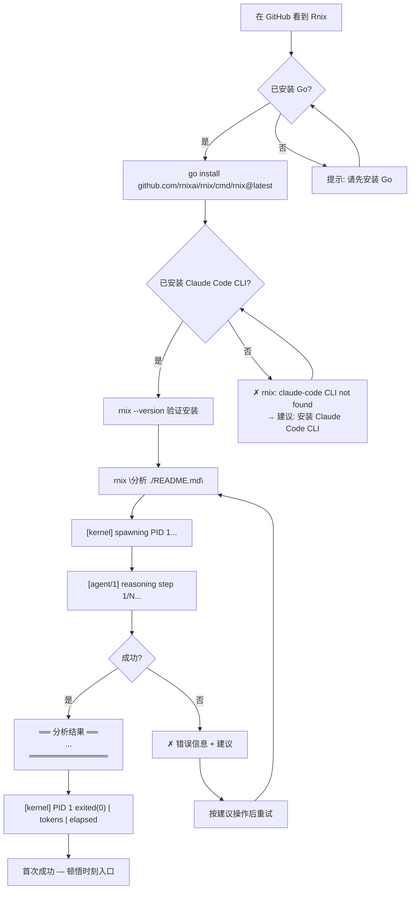
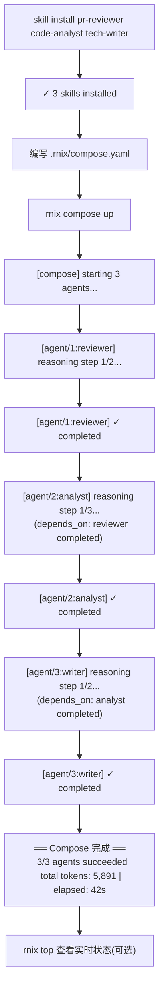
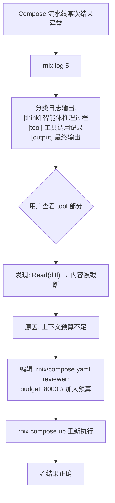
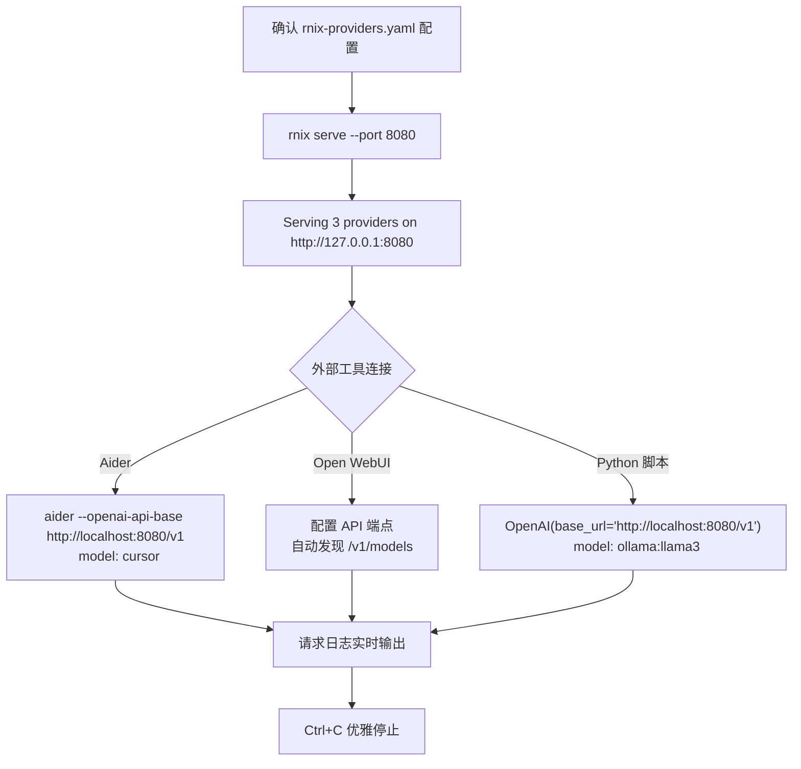
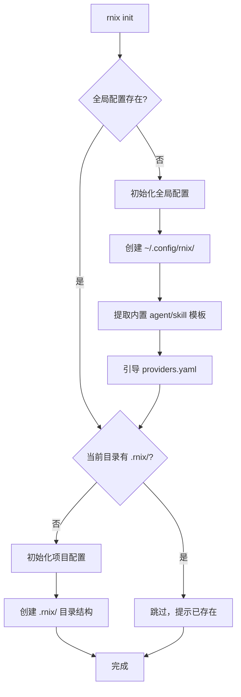
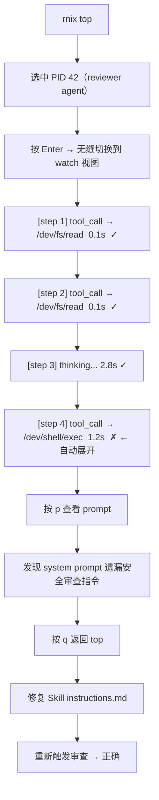

# UX Design Specification Rnix

**Author:** Decker
**Date:** 2026-02-23

---

<!-- UX design content will be appended sequentially through collaborative workflow steps -->

## Executive Summary

### Project Vision

Rnix 是一个面向 AI 智能体的操作系统，纯 CLI 交互界面，用 Go 语言构建。它将智能体视为操作系统的一等计算单元，通过进程模型、虚拟文件系统、系统调用接口等 OS 级原语，解决当前多智能体系统的调试黑盒、能力不可复用、多智能体协调困难三大核心问题。

Rnix 的 UX 核心不是视觉设计，而是 **CLI 信息架构与交互反馈设计**——让开发者在终端中获得清晰、可预测、高信息密度的操作体验。设计哲学对标 Unix 工具链：每个命令做好一件事，输出可组合，错误信息可行动。

### Target Users

**用户 A — 平台构建者（陈明，核心用户）**
- 独立开发者 / 基础设施工程师，深度使用终端
- 编写 Skill 包（SKILL.md + instructions.md），用 strace/gdb 调试
- 核心痛点：多智能体调试是黑盒，能力无法跨项目复用
- UX 期望：精确、透明、可追溯——能看到智能体决策链的每一步
- 顿悟时刻：`rnix strace 1` 三分钟定位三天找不到的 bug

**用户 B — 应用开发者（林薇，Phase 2 用户）**
- 全栈开发者，不关心内核实现，只要能快速组装工作流
- 通过 `skill install` + `.rnix/compose.yaml` 使用现成能力
- 核心痛点：现有框架编排太复杂，能力不可共享
- UX 期望：简单、声明式、开箱即用——20 行 YAML 替代 2000 行代码
- 顿悟时刻：`rnix compose up` 一键启动完整流水线

### Key Design Challenges

1. **CLI 信息密度与可读性的平衡：** strace 输出可能包含大量 syscall 数据（名称、参数、返回值、耗时），如何在实时流式输出中保持可读性而不淹没用户？需要设计分层信息展示——默认显示关键摘要，`--verbose` 展开完整细节。

2. **实时进度反馈的节奏感：** reasonStep 循环中智能体在 LLM 调用与工具执行之间交替，每步可能耗时数秒到数十秒。需要设计清晰的实时进度指示器，让用户知道"系统在做什么、进行到哪一步"，而不是盯着静默的终端猜测。

3. **错误信息的可行动性：** LLM 超时、文件路径错误、Skill 加载失败等错误场景多样。错误信息需要包含三要素：发生了什么（设备路径 + 错误原因）、影响是什么（进程状态变化）、建议做什么（重试 / 检查配置 / 查看日志）。

4. **Unix 隐喻的认知负荷：** 进程、VFS、设备、挂载等 OS 概念对目标用户（已熟悉 Unix）是直觉性的，但 Agent OS 语境下的语义差异（如 `/proc/{pid}/context` 是对话历史而非内存映射）需要通过一致的命名和输出格式让用户快速建立正确的心智模型。

### Design Opportunities

1. **strace 作为差异化体验入口：** 没有任何现有多智能体框架提供 syscall 级追踪。strace 的实时流式输出设计好了，就是最强的产品传播素材——开发者截一张终端截图就能让人理解 Rnix 的价值。

2. **渐进式复杂度曲线：** MVP 只需掌握三个命令（`rnix "意图"`、`rnix strace`、`rnix ps`），Phase 2 扩展到 Compose 和管道。这种从"一个命令就能用"到"完整 Shell 语法"的渐进式学习路径是天然的 UX 优势。

3. **结构化输出双模式（人读 + 机读）：** 默认输出为结构化可读型（颜色、分组、表格），`--json` 切换为机器可解析格式。这使得 Rnix 的输出可以被其他工具消费（grep、jq、管道），符合 Unix 组合哲学。

### CLI Interaction Principles

基于用户反馈确立的 UX 设计原则：

| 原则 | 说明 |
|------|------|
| **结构化可读优先** | 默认输出带颜色、分组、表格，对人友好；`--json` 提供机器可解析格式 |
| **实时流式反馈** | strace 实时流式输出（类 `tail -f`），reasonStep 显示实时 step 进度 |
| **错误可行动** | 每条错误包含：发生了什么 + 影响是什么 + 建议做什么 |
| **渐进式复杂度** | 入门三命令 → 完整 Shell 语法，用户按需深入 |
| **Unix 直觉** | 命令语法、输出格式、管道组合对标 Unix 惯例，降低学习成本 |

## Core User Experience

### Defining Experience

Rnix 的核心体验由两个交替的交互循环构成：

**循环 A — 执行循环（spawn-observe-result）：**
```
rnix "分析 ./src/auth.go" → [实时进度] → 结果输出
```
日常主循环。用户用一句自然语言启动智能体，观察实时进度反馈，获取结果。这个循环必须做到"一条命令，什么都不用想"——系统自动匹配 Skill、选择模型、分配上下文。

**循环 B — 调试循环（spawn-debug-fix）：**
```
rnix "审查 PR" → 结果异常 → rnix strace 1 → 定位问题 → 修复 → 重跑
```
当循环 A 产出不符合预期时，用户进入循环 B。strace 提供完整的 syscall 链路，用户定位问题根因，修复后重新执行。这个循环是 Rnix 的差异化核心——把"猜"变成"看"。

**双循环关系：** 用户大部分时间在循环 A 中工作。当结果不对时，无缝切换到循环 B。定位修复后，回到循环 A。两个循环之间的切换必须是零摩擦的——不需要额外配置、不需要重启、不需要换工具。

### Platform Strategy

| 维度 | 决策 |
|------|------|
| **平台** | 终端 CLI（纯键盘交互） |
| **运行环境** | macOS / Linux 终端（开发者工作站） |
| **安装方式** | `go install` 单命令，单二进制，零配置 |
| **前置依赖** | 至少一个已配置的 LLM provider（默认 Claude Code CLI） |
| **输出模式** | 结构化可读（默认） / JSON（`--json`） |
| **离线支持** | 不适用（依赖 LLM API） |
| **终端兼容性** | 支持 ANSI 256 色，graceful 降级到无色模式 |

### Effortless Interactions

**以下四个交互必须达到"零思考"级别：**

**1. 一句话启动 — 意图即全部**
```bash
$ rnix "分析这段代码的性能瓶颈"
```
用户只需要表达意图。系统自动完成：Skill 匹配与加载 → 模型选择 → 上下文分配 → 进程创建 → 推理循环启动。**不需要指定 `--agent`、`--model`、`--budget`。** 这些参数存在但作为可选覆盖项，而非必填。

**2. Skill 智能匹配**
系统根据意图文本自动推荐/加载最合适的 Skill。如果匹配到多个候选，显示简短选择列表。如果没有匹配到，使用通用模式（无 Skill 注入）仍然可以执行。**用户永远不会因为"不知道该用哪个 Skill"而卡住。**

**3. 错误即指引**
每条错误信息都是一个行动指南：
```
✗ /dev/llm/claude: request timeout (30s)
  → PID 3 state: running → zombie (exit code: 1)
  → 建议: rnix "分析 ./src/scheduler.go"  重新执行
```
三行结构：发生了什么 → 影响是什么 → 该做什么。用户看到错误信息后，下一步行动是清晰的。

**4. strace 关键信息一眼可见**
默认输出模式高亮关键 syscall（文件读写、LLM 调用、错误），折叠常规操作。异常 syscall 用颜色标记。用户不需要翻滚搜索——问题所在的 syscall 在视觉上"跳出来"。

### Critical Success Moments

**生死时刻：第一次 `rnix "意图"` 跑通**

这是 Rnix 最关键的用户体验时刻。如果第一次执行失败或输出令人困惑，用户会立刻离开。

**第一次跑通必须满足的体验标准：**

| 时刻 | 体验要求 |
|------|---------|
| **输入命令** | 一条命令，零配置，零前置知识 |
| **等待过程** | 实时进度输出，用户始终知道系统在做什么 |
| **结果输出** | 清晰的结构化结果，视觉上令人愉悦的格式 |
| **完成汇总** | 退出码、token 消耗、耗时——让用户感到系统是透明和可控的 |
| **总耗时** | ≤ 30 秒（简单任务），用户耐心窗口之内 |

**理想的首次体验流程：**
```
$ rnix "分析 ./kernel/scheduler.go 并找出性能瓶颈"

[kernel] spawning PID 1...
[agent/1] loading skill: code-analyst
[agent/1] reading /dev/fs/kernel/scheduler.go...
[agent/1] reasoning step 1/3...
[agent/1] reasoning step 2/3...
[agent/1] reasoning step 3/3...

══ 分析结果 ══════════════════════════════════════
发现 2 个性能瓶颈：
1. scheduler.go:47 — 全局锁竞争，建议改为分片锁
2. scheduler.go:89 — O(n) 线性扫描，建议改为堆结构
══════════════════════════════════════════════════

[kernel] PID 1 exited(0) | tokens: 1,847 | elapsed: 6.2s
```

每一行输出都有目的：进程创建 → Skill 加载 → 文件读取 → 推理步骤 → 结果 → 汇总。用户全程知道"系统在做什么"。

**第二关键时刻：首次 strace 调试**

当用户第一次使用 `rnix strace` 并成功定位到问题时，他们会从"试试看"变成"这就是我需要的工具"。这个时刻的信息清晰度决定了用户是否长期留存。

### Experience Principles

| # | 原则 | 含义 | 指导什么决策 |
|---|------|------|-------------|
| 1 | **意图即入口** | 用户只需要表达"要什么"，系统处理"怎么做" | 命令设计、Skill 匹配、默认参数策略 |
| 2 | **始终透明** | 用户在任何时刻都知道系统在做什么、进行到哪一步 | 进度反馈、strace 设计、状态输出 |
| 3 | **错误即路标** | 每条错误信息指向下一步行动，而非死胡同 | 错误消息格式、恢复建议、退出码设计 |
| 4 | **Unix 直觉** | 命令语法、输出格式、组合方式对标开发者已有的 Unix 心智模型 | 命令命名、管道支持、`--json` 输出 |
| 5 | **渐进深入** | 入门零配置一条命令，进阶按需暴露完整控制力 | 参数设计、文档层次、CLI 帮助信息 |

## Desired Emotional Response

### Primary Emotional Goals

Rnix 的情感设计围绕三个核心感受，按日常触发频率排列：

| 核心情感 | 触发场景 | 设计含义 |
|---------|---------|---------|
| **掌控感** | 每一次命令执行——实时进度、strace 链路、进程状态 | 系统状态始终透明可见，用户永远不会"不知道发生了什么" |
| **高效感** | 一条命令完成以前需要大量胶水代码的工作 | 最少输入、最大产出，消除一切不必要的中间步骤 |
| **可靠感** | 错误发生时——清晰的诊断、明确的下一步、进程不卡死 | 系统在任何情况下都给出可行动的反馈，永远不让用户掉进死胡同 |

**三者的关系：** 掌控感是基底（时刻存在），高效感是日常奖励（每次使用都能感受到），可靠感是安全网（出问题时托住用户）。三者缺一不可——没有掌控感，高效感就是黑盒魔术；没有可靠感，掌控感在第一次错误时就崩塌。

### Emotional Journey Mapping

| 阶段 | 用户状态 | 目标情感 | 避免的情感 | 设计手段 |
|------|---------|---------|-----------|---------|
| **发现** | 在 GitHub 上看到 Rnix | 好奇 + 共鸣（"这说的就是我的痛点"） | 困惑（"这是什么？"） | README 直击调试痛点，strace 截图作为视觉钩子 |
| **安装** | `go install` | 顺畅 + 轻松（"就这样？装好了？"） | 挫败（依赖问题、配置繁琐） | 单二进制零配置，唯一前置条件明确提示 |
| **首次执行** | `rnix "分析代码"` | 惊喜 + 掌控（"它在实时告诉我每一步"） | 焦虑（等待无反馈）、困惑（输出看不懂） | 实时进度输出，结构化结果，完成汇总 |
| **日常使用** | 循环 A 反复执行 | 高效 + 自然（"这就是该有的工作方式"） | 厌烦（重复操作多）、不确定（"这次会正常吗？"） | 最少输入、一致的输出格式、可预测的行为 |
| **遇到错误** | LLM 超时 / 结果异常 | 从容 + 清晰（"我知道怎么办"） | 恐慌（"数据丢了吗？"）、茫然（"什么意思？"） | 三行错误结构、进程状态正确转移、恢复建议 |
| **调试顿悟** | 首次 `strace` 定位 bug | 震撼 + 共鸣 + 理所当然 | 失望（"和翻日志没区别"） | syscall 链路直指问题根因，关键信息视觉高亮 |
| **长期使用** | 成为日常工具 | 信赖 + 依赖（"没有这个我怎么工作？"） | 被抛弃感（工具不更新、社区沉寂） | 稳定的 ABI 契约、Skill 生态持续丰富 |

### Micro-Emotions

**关键微情感对照（目标状态 vs 避免状态）：**

| 维度 | 目标状态 | 避免状态 | 触发场景 |
|------|---------|---------|---------|
| **信心 vs 困惑** | "我知道下一步做什么" | "这个命令是什么意思？" | 每一次命令输入和输出 |
| **信任 vs 怀疑** | "系统给出的结果是可靠的" | "这个分析结果对吗？" | 智能体输出结果时 |
| **成就 vs 挫败** | "三分钟搞定了" | "又失败了，从头再来" | 任务完成或调试定位时 |
| **惊叹 vs 平淡** | "这也行？太强了" | "嗯……也就这样" | 首次体验 strace、首次 Skill 组合 |
| **自然 vs 勉强** | "本来就应该这样" | "为什么要这么麻烦？" | 日常重复使用时 |

**顿悟时刻的三层情感叠加：**

当陈明第一次用 `rnix strace 1` 在三分钟内定位到一个耗费三天的 bug 时，他应该同时感受到：

1. **"终于有人理解开发者的痛了"**（共鸣 + 认同）— 这个工具的设计者经历过和我一样的痛苦
2. **"这个工具太强了"**（震撼 + 敬佩）— syscall 链路把黑盒完全打开了
3. **"就应该是这样"**（自然 + 理所当然）— 这不是魔术，这是操作系统本来就该提供的能力

这三层从感性到理性递进：先被打动，再被折服，最后理解"为什么"。这个情感序列驱动用户从"试试看"变成"这是我的工具"。

### Design Implications

| 情感目标 | UX 设计手段 |
|---------|-----------|
| **掌控感** | 每条命令都有实时进度输出；`rnix ps` 随时查看全局状态；strace 暴露完整决策链路；完成时输出 token/耗时汇总 |
| **高效感** | 一句话意图启动；Skill 智能匹配；最少参数设计（可选项多、必填项少）；`--json` 支持管道组合 |
| **可靠感** | 进程状态始终一致（不卡死）；错误三行结构（什么 + 影响 + 建议）；Zombie 自动回收；退出码语义清晰 |
| **好奇 → 共鸣** | README 以调试痛点故事开头；strace 终端截图作为传播素材 |
| **惊叹 → 自然** | 首次体验精心设计（demo Skill 预装）；渐进式复杂度让高级功能在需要时自然出现 |
| **信任** | 输出格式一致可预测；同一命令同一输入总是同一输出结构；ABI 稳定不 breaking change |

### Emotional Design Principles

| # | 原则 | 含义 |
|---|------|------|
| 1 | **永不黑盒** | 用户在任何时刻都能回答"系统在做什么"——这是掌控感的基础 |
| 2 | **错误是对话，不是终结** | 每次错误都是系统在说"我遇到了这个问题，建议你这样做"——维护可靠感 |
| 3 | **少即是多** | 用最少的用户输入撬动最大的系统能力——强化高效感 |
| 4 | **一致性建立信任** | 相同类型的操作，永远有相同格式的输出——信任来自可预测 |
| 5 | **惊喜要有根基** | 顿悟时刻之所以震撼，是因为它建立在用户已经理解的 OS 概念上——不是魔术，是工程 |

## UX Pattern Analysis & Inspiration

### Inspiring Products Analysis

**1. strace / dtrace — 系统追踪的原型**

| 维度 | 分析 |
|------|------|
| **核心价值** | 一条命令看到进程的所有系统调用，把黑盒变成白盒 |
| **做得好的** | 零配置即可使用；输出包含完整的调用链（函数名、参数、返回值、耗时）；可过滤特定 syscall 类型 |
| **做得不好的** | 输出密集无结构，新手难以快速定位关键信息；无颜色区分，所有 syscall 视觉权重相同；没有"摘要模式"，只有原始流 |
| **对 Rnix 的启示** | strace 继承 strace 的"完整追踪"理念，但必须解决信息过载问题——默认输出应分层（关键 syscall 高亮，常规操作折叠），而非平铺所有内容 |

**2. Docker CLI — 生命周期管理的标杆**

| 维度 | 分析 |
|------|------|
| **核心价值** | 用简洁的命令动词管理容器的完整生命周期：run、ps、stop、rm、logs |
| **做得好的** | 命令语义直觉化（`docker ps` = 看容器列表）；输出是对齐的表格，列头清晰；`docker logs -f` 实时流式跟踪；错误信息包含建议（"did you mean..."） |
| **做得不好的** | 子命令层级过深（`docker container ls` vs `docker ps`）；某些场景下输出被截断但未提示 |
| **对 Rnix 的启示** | `rnix ps` 直接对标 `docker ps` 的表格输出格式；`rnix strace` 对标 `docker logs -f` 的实时流式体验；命令动词保持扁平，不做过深的子命令嵌套 |

**3. cargo (Rust) — 进度反馈与彩色输出的标杆**

| 维度 | 分析 |
|------|------|
| **核心价值** | Rust 的构建工具，以清晰的彩色分阶段输出著称 |
| **做得好的** | 每个阶段用不同颜色的动词前缀（绿色 `Compiling`、蓝色 `Downloading`、红色 `error`）；编译进度实时更新（`[3/47]`）；错误信息极其详细，包含原因、位置、修复建议 |
| **做得不好的** | 大型项目输出过长时缺乏摘要 |
| **对 Rnix 的启示** | reasonStep 实时进度对标 cargo 的 `[1/3]` 步骤计数；颜色编码对标 cargo 的阶段着色系统；错误信息对标 cargo 的"原因 + 位置 + 建议"三段式 |

**4. htop / btop — 实时监控面板的标杆**

| 维度 | 分析 |
|------|------|
| **核心价值** | 终端内的实时系统监控面板，信息密度极高但仍然可读 |
| **做得好的** | 颜色编码区分资源使用级别；分区布局（CPU/内存/进程列表）；支持排序、过滤、交互式操作 |
| **做得不好的** | 信息过于密集，初次使用有学习曲线 |
| **对 Rnix 的启示** | Phase 2 的 `rnix top` 可以借鉴 htop 的分区布局——上方显示全局资源（总 token 消耗、活跃进程数），下方显示进程列表（PID、状态、Skill、token、耗时） |

**5. git — 渐进式复杂度的典范**

| 维度 | 分析 |
|------|------|
| **核心价值** | 入门三命令（add/commit/push），但完整语法支持几十个高级操作 |
| **做得好的** | 核心工作流极简；`git status` 输出包含下一步操作提示（"use git add to track..."）；帮助系统分层（`--help` 简要 vs `man` 完整） |
| **做得不好的** | 某些命令语义不直觉（`checkout` 既切分支又撤销修改）；错误信息有时晦涩 |
| **对 Rnix 的启示** | MVP 三命令入门（`rnix "意图"` / `rnix strace` / `rnix ps`），对标 git 的渐进式学习曲线；`rnix ps` 输出可以像 `git status` 一样包含下一步操作提示 |

### Transferable UX Patterns

**信息展示模式：**

| 模式 | 来源 | 在 Rnix 中的应用 |
|------|------|----------------|
| **彩色动词前缀** | cargo | `[kernel]` 灰色、`[agent/1]` 蓝色、`[error]` 红色、`[result]` 绿色 |
| **步骤计数器** | cargo `[3/47]` | `reasoning step 1/3...` 实时进度 |
| **对齐表格输出** | docker ps | `rnix ps` 输出 PID / STATE / SKILL / TOKENS / ELAPSED 对齐列 |
| **实时流式日志** | docker logs -f | `rnix strace <pid>` 实时 syscall 流 |
| **操作提示嵌入** | git status | 错误输出末尾附带"建议: ..."，`rnix ps` 显示可用操作 |
| **分区面板** | htop | `rnix top`（Phase 2）上方汇总 + 下方进程列表 |

**交互模式：**

| 模式 | 来源 | 在 Rnix 中的应用 |
|------|------|----------------|
| **一条命令启动** | docker run | `rnix "意图"` 零配置启动 |
| **双模式输出** | kubectl (-o json/yaml/wide) | 默认结构化可读 / `--json` 机器可解析 |
| **过滤与聚焦** | strace -e | `rnix strace --filter=llm` 只看 LLM 相关 syscall |
| **渐进式复杂度** | git | 入门三命令 → Phase 2 完整 Shell 语法 |

### Anti-Patterns to Avoid

| 反模式 | 来源 | 为什么避免 | Rnix 的对策 |
|--------|------|-----------|-----------|
| **密集无结构输出** | strace 原始输出 | 信息过载，用户无法快速定位关键内容 | 默认输出高亮关键 syscall，折叠常规操作，`--verbose` 展开全部 |
| **子命令过深** | docker 的双层命令 | 增加记忆负担，打字更多 | 保持扁平命令结构：`rnix ps`、`rnix strace`，不做 `rnix process list` |
| **晦涩的错误信息** | git 的某些错误提示 | 用户不知道该做什么 | 每条错误包含三要素：发生了什么 + 影响 + 建议的下一步 |
| **不一致的输出格式** | 多种 CLI 工具 | 用户无法建立可预测的心智模型 | 所有命令遵循统一的输出模板：header → content → footer(summary) |
| **静默长等待** | 某些 AI CLI 工具 | 用户不知道系统是否卡死 | reasonStep 每一步都有实时进度输出，LLM 调用期间显示等待指示器 |
| **截断不提示** | docker 某些场景 | 用户看到不完整的信息却以为是全部 | 输出被截断时明确提示"已截断，使用 --full 查看完整内容" |

### Design Inspiration Strategy

**采纳（直接使用）：**

| 模式 | 理由 |
|------|------|
| cargo 的彩色阶段前缀 | 天然适配 Rnix 的多阶段输出（spawn → load → reason → result） |
| cargo 的步骤计数 `[n/m]` | 直接用于 reasonStep 进度展示 |
| docker ps 的对齐表格 | 直接用于 `rnix ps` 进程列表 |
| docker logs -f 的实时流 | 直接用于 `rnix strace` 实时追踪 |
| git status 的操作提示 | 直接用于错误信息中的恢复建议 |

**改造（适配后使用）：**

| 模式 | 改造方式 |
|------|---------|
| strace 的完整 syscall 输出 | 增加分层：默认显示摘要级（高亮关键调用），`--verbose` 展开完整参数和返回值 |
| htop 的分区面板 | 简化为 Rnix 语境：上方 token 预算 + 活跃进程数，下方进程表格（Phase 2 `rnix top`） |
| kubectl 的多输出格式 | 简化为两种：默认人读 + `--json` 机读（不需要 yaml/wide 等多种变体） |

**规避（明确不做）：**

| 模式 | 理由 |
|------|------|
| 深层子命令嵌套 | Rnix 命令数量有限，不需要分层，扁平更直觉 |
| 交互式 TUI（如 lazygit） | MVP 阶段保持纯命令行输入/输出，不引入 TUI 框架复杂度 |
| 隐式截断 | 所有截断必须显式提示，CLI 工具的信任来自信息完整性 |

## Design System Foundation

### Design System Choice

**选择：Charm 完整 TUI 生态**

| 组件 | 库 | 用途 |
|------|-----|------|
| **命令框架** | `cobra` | CLI 命令注册、参数解析、帮助信息生成 |
| **TUI 框架** | `bubbletea` | 交互式终端 UI（`rnix top`、未来的 `gdb`） |
| **样式引擎** | `lipgloss` | 声明式终端样式（颜色、边框、对齐、间距） |
| **表格组件** | `table`（Charm） | `rnix ps` 对齐表格输出 |
| **预制组件** | `bubbles` | spinner、进度条、文本输入等基础组件 |
| **日志输出** | `log`（Charm） | 带颜色和级别的结构化日志 |

### Rationale for Selection

| 决策因素 | 分析 |
|---------|------|
| **一步到位** | MVP 阶段用 lipgloss + table 做纯输出；Phase 2 的 `rnix top`、`rnix log` 直接用 bubbletea，无需迁移 |
| **生态成熟度** | Charm 是 Go CLI/TUI 工具的事实标准，bubbletea 30k+ stars，社区活跃，文档完善 |
| **架构一致性** | bubbletea 的 Elm 架构（Model-Update-View）与 Rnix 的事件驱动设计哲学高度契合 |
| **渐进式使用** | 不要求一开始就写 TUI——MVP 阶段可以只用 lipgloss 做样式输出，bubbletea 仅备用 |
| **调试工具链铺垫** | Phase 2+ 的 `gdb` 交互式调试器、可视化调试面板天然需要 TUI 框架 |

### Implementation Approach

**MVP 阶段（Phase 1）— 纯输出模式：**

仅使用 Charm 生态的输出能力，不启用交互式 TUI：

| 功能 | 实现方式 |
|------|---------|
| `rnix "意图"` 实时进度 | lipgloss 样式 + bubbles spinner |
| `rnix ps` 进程表格 | Charm table 组件 |
| `rnix strace` 实时流 | lipgloss 样式 + 标准输出流 |
| 错误信息 | lipgloss 红色样式 + 结构化模板 |
| 完成汇总 | lipgloss 边框 + 颜色标记 |

**Phase 2 — 引入交互式 TUI：**

| 功能 | 实现方式 |
|------|---------|
| `rnix top` 实时面板 | bubbletea 全屏 TUI + table + 实时刷新 |
| `rnix log` 交互式日志 | bubbletea + 过滤/搜索组件 |
| Skill 搜索/安装 | bubbletea 列表选择 + 搜索框 |

**Phase 3 — 高级交互式工具：**

| 功能 | 实现方式 |
|------|---------|
| `gdb` 交互式调试 | bubbletea 多面板（源码 + 变量 + 调用栈） |
| 可视化调试面板 | bubbletea + 自定义绘图组件 |

### Customization Strategy

**终端颜色系统：**

| 角色 | 颜色 | 用途 |
|------|------|------|
| **内核消息** | 灰色 `#888888` | `[kernel]` 前缀，系统级信息 |
| **智能体活动** | 蓝色 `#5B9BD5` | `[agent/N]` 前缀，进程行为 |
| **成功/结果** | 绿色 `#6BCB77` | 结果输出、成功状态、exit(0) |
| **警告** | 黄色 `#FFD93D` | 性能提示、接近预算上限 |
| **错误** | 红色 `#FF6B6B` | 错误信息、失败状态、exit(non-0) |
| **高亮/重点** | 白色加粗 | 关键数据（PID、文件路径、token 数） |
| **次要信息** | 暗灰色 `#666666` | 时间戳、辅助说明 |

**输出结构模板：**

所有命令输出遵循统一的三段式结构：

```
[header]    命令执行上下文（PID、Skill、目标）
[content]   命令主体输出（进度、结果、表格）
[footer]    汇总信息（退出码、token、耗时）
```

**结果边框样式：**

```
══ 分析结果 ══════════════════════════════════════
  内容区域，左侧 2 空格缩进
  保持清晰可读
══════════════════════════════════════════════════
```

**表格样式规范（`rnix ps`）：**

```
PID   STATE     SKILL          TOKENS   ELAPSED
  1   running   code-analyst     1,847   6.2s
  2   zombie    —                  423   2.1s
  3   dead      pr-reviewer      3,201   12.8s
```

- 列头大写，数据左对齐（文本）/ 右对齐（数字）
- 状态列用颜色标记（running=蓝、zombie=黄、dead=灰）

**`--json` 输出规范：**

当指定 `--json` 时，所有命令输出纯 JSON，无颜色、无边框、无装饰：

```json
{
  "pid": 1,
  "state": "running",
  "skill": "code-analyst",
  "tokens": 1847,
  "elapsed_ms": 6200
}
```

**无色模式降级：**

当终端不支持颜色（`NO_COLOR` 环境变量或非 TTY 输出）时：
- 所有颜色标记降级为纯文本
- 边框字符保留（`══`）
- 状态用文本标签替代颜色（`[ERR]`、`[OK]`、`[WARN]`）

## Defining Core Interaction

### Defining Experience

> **"一句话说意图，全程看到智能体的每一步决策。"**

这是 Rnix 的"灵魂交互"——用户用一句自然语言表达意图，系统自动启动一个智能体进程去执行，全程实时汇报每一步在做什么、看到了什么、决定了什么。

**类比：** Tinder 有滑动，Instagram 有滤镜，Rnix 有"意图 → 透明执行"。

**用一句话向朋友描述：** "你告诉它要做什么，它就去做，而且你能看到它每一步是怎么想的。"

### User Mental Model

**核心心智模型：委派任务给一个透明的同事**

用户输入 `rnix "分析代码性能瓶颈"` 时，他脑子里的画面不是"运行一个脚本"，也不是"启动一个进程"——而是**把一个任务委派给一个能力很强的同事，这个同事会实时向你汇报他的工作进展**。

这个心智模型决定了 Rnix 的一切交互语言：

| 维度 | "脚本"模型（不采用） | "同事"模型（采用） |
|------|-------------------|------------------|
| **启动** | "运行脚本" | "委派任务" |
| **等待中** | 静默等待或 spinner | 同事在实时汇报"我在看这个文件""我发现了一个问题" |
| **输出语气** | `INFO: processing file X` | `[agent/1] reading /dev/fs/scheduler.go...` |
| **完成** | `exit code 0` | 同事交付了一份报告，附带汇总 |
| **出错** | `ERROR: timeout` | 同事说"这个任务遇到了问题，建议这样处理" |
| **追踪** | 查看日志文件 | 旁听同事的完整工作过程（strace） |

**心智模型的设计推论：**

1. **输出应该是"汇报"而非"日志"：** `[agent/1] reasoning step 2/3...` 读起来像同事在说"我在处理第二步"，而非程序在打日志。
2. **结果应该是"交付物"而非"输出"：** 双线边框包裹的分析结果像一份正式报告，而非 stdout 的文本流。
3. **错误应该是"反馈"而非"崩溃"：** 同事不会"崩溃"，他会说"我遇到了这个问题，建议我们这样处理"。
4. **strace 是"旁听"而非"翻日志"：** 你在实时旁听同事的完整思考和行动过程，而非事后翻阅记录。

**与现有解决方案的心智模型对比：**

| 现有方案 | 用户心智模型 | 问题 |
|---------|-----------|------|
| LangGraph | "画一张流程图，让机器按图执行" | 太机械，用户是工程师而非操作员 |
| AutoGen | "一群聊天机器人在对话" | 太随意，结果不可控 |
| 直接用 Claude API | "调用一个函数，获取返回值" | 太底层，每次都要写胶水代码 |
| **Rnix** | **"委派任务给一个透明的同事"** | 高层次意图 + 全程可见 = 信任 |

### Success Criteria

**核心交互成功的判定标准：**

| # | 标准 | 可验证方式 |
|---|------|-----------|
| 1 | **零配置启动** | 用户输入 `rnix "意图"` 后不需要任何额外操作即可看到智能体开始工作 |
| 2 | **全程可见** | 从 spawn 到完成，用户在每个时刻都能回答"智能体在做什么" |
| 3 | **结果即交付** | 最终输出是一份结构清晰的"报告"，不需要用户从原始输出中自己提炼 |
| 4 | **出错不失控** | 任何错误场景下，用户都知道发生了什么、影响是什么、下一步怎么办 |
| 5 | **追溯可达** | 对结果有疑问时，`strace` 可以完整回溯到每一步决策的因果链 |
| 6 | **30 秒内见结果** | 简单任务（单文件分析）从输入到完成不超过 30 秒 |

**用户怎么知道他"用对了"：**
- 智能体的实时汇报让他感觉"这个同事很靠谱，在认真干活"
- 结果报告清晰到他可以直接拿去用，不需要二次加工
- 如果结果不对，`strace` 让他三分钟内就能找到原因

### Novel UX Patterns

**创新与传统的混合策略：**

Rnix 的核心交互采用"**Unix 外壳 + 同事内核**"的混合模式——命令语法和管道组合遵循 Unix 传统（已有心智模型），但信息呈现和交互语气采用"委派同事"的创新模式。

| 层面 | 策略 | 具体体现 |
|------|------|---------|
| **命令语法** | 沿用 Unix 传统 | `rnix "意图"`、`rnix ps`、`rnix strace <pid>` |
| **参数设计** | 沿用 Unix 传统 | `--agent`、`--model`、`--json`、`--verbose` |
| **管道组合** | 沿用 Unix 传统 | `rnix strace 1 \| grep "llm"`（Phase 2: 智能体管道） |
| **输出语气** | 创新：汇报式 | `[agent/1] reading...` 而非 `INFO: reading...` |
| **结果呈现** | 创新：交付物式 | 双线边框包裹的结构化报告 |
| **错误处理** | 创新：反馈式 | "遇到了 X 问题，建议做 Y" 而非 "ERROR: X" |
| **strace** | 创新：旁听式 | 实时旁听同事的思考和行动过程 |

**不需要教育用户的部分：** 命令语法、参数格式、管道组合——开发者已经会了。

**需要让用户自然领会的部分：** 输出不是"日志"而是"汇报"，结果不是"输出"而是"交付物"，strace 不是"翻日志"而是"旁听"。这些不需要文档教育——通过输出格式本身的设计自然传达。

### Experience Mechanics

**核心交互的完整机制分解：**

**1. 启动（Initiation）— "委派任务"**

```
$ rnix "分析 ./kernel/scheduler.go 并找出性能瓶颈"
```

- 触发方式：一句自然语言，引号包裹
- 系统响应：立即显示 `[kernel] spawning PID 1...`（确认任务已接收）
- 零等待感：用户输入后 < 1 秒看到第一行反馈
- 自动完成：Skill 匹配、模型选择、上下文分配全部静默处理

**2. 执行（Interaction）— "同事在工作"**

```
[agent/1] loading skill: code-analyst
[agent/1] reading /dev/fs/kernel/scheduler.go...
[agent/1] reasoning step 1/3...
[agent/1] reasoning step 2/3...
[agent/1] reasoning step 3/3...
```

- 用户角色：观察者（无需操作，但始终知情）
- 系统输出节奏：每个重要动作一行汇报（加载 Skill → 读文件 → 推理步骤）
- 进度感知：`step N/M` 明确告知总步数和当前进度
- 可打断：Ctrl+C 发送 SIGTERM，智能体优雅退出

**3. 反馈（Feedback）— "同事在汇报"**

成功时：
```
══ 分析结果 ══════════════════════════════════════
发现 2 个性能瓶颈：
1. scheduler.go:47 — 全局锁竞争，建议改为分片锁
2. scheduler.go:89 — O(n) 线性扫描，建议改为堆结构
══════════════════════════════════════════════════
```

失败时：
```
✗ /dev/llm/claude: request timeout (30s)
  → PID 1 state: running → zombie (exit code: 1)
  → 建议: rnix "分析 ./kernel/scheduler.go"  重新执行
```

- 成功反馈：双线边框包裹的结构化报告，内容清晰可直接使用
- 失败反馈：三行结构（发生了什么 → 影响 → 建议），错误即路标

**4. 完成（Completion）— "任务交付"**

```
[kernel] PID 1 exited(0) | tokens: 1,847 | elapsed: 6.2s
```

- 完成信号：`exited(0)` 明确告知成功（非零表示异常）
- 成本透明：token 消耗让用户感知"这个任务花了多少资源"
- 效率感知：耗时显示强化"快"的感受
- 下一步清晰：成功 → 使用结果；失败 → 按建议行动；疑问 → `rnix strace <pid>`

## Visual Design Foundation

### Color System

**品牌色调基础：深空蓝 + 冷白光**

Rnix 的名字来自南十字星座——导航的基准点。视觉语言从这个意象出发：深邃的空间感（深色背景终端中的冷色调），点缀精确的亮光（高亮信息如星辰般突出）。

**主色调：**

| 角色 | 颜色 | Hex | 用途 |
|------|------|-----|------|
| **Rnix Blue** | 冷蓝 | `#5B9BD5` | 品牌主色，`[agent/N]` 前缀，活跃状态 |
| **Rnix Cyan** | 冰青 | `#56D4C8` | 强调色，Skill 名称，路径高亮 |

**语义色：**

| 角色 | 颜色 | Hex | 用途 |
|------|------|-----|------|
| **成功** | 翠绿 | `#6BCB77` | 结果输出，exit(0)，`══` 边框 |
| **警告** | 琥珀 | `#FFD93D` | 接近预算上限，zombie 状态 |
| **错误** | 珊瑚红 | `#FF6B6B` | 错误信息，`✗` 前缀，exit(non-0) |
| **内核/系统** | 中灰 | `#888888` | `[kernel]` 前缀，系统级消息 |
| **次要信息** | 暗灰 | `#666666` | 时间戳、辅助说明、折叠内容 |
| **高亮** | 亮白加粗 | `#FFFFFF bold` | PID、文件路径、token 数、关键数据 |

**色彩使用原则：**

| 原则 | 说明 |
|------|------|
| **颜色即语义** | 每种颜色只对应一种含义——蓝色永远是智能体活动，红色永远是错误。绝不混用 |
| **暗底优先** | 设计基于深色终端背景（大多数开发者使用深色主题），浅色背景下仍可读 |
| **克制使用** | 一屏输出中有颜色的文本不超过 40%，避免"圣诞树效应" |
| **降级完备** | `NO_COLOR` 环境变量或非 TTY 输出时，所有颜色降级为纯文本标签 |

### Typography System

**终端排版规范：**

CLI 工具运行在等宽字体环境中，排版设计不涉及字体选择，而是关于**字符空间的使用方式**。

**信息层级（通过格式而非字号）：**

| 层级 | 格式手段 | 示例 |
|------|---------|------|
| **L1 — 标题/分隔** | 双线边框 `══` | `══ 分析结果 ══════════════` |
| **L2 — 主要信息** | 颜色 + 加粗 | `[agent/1] reasoning step 2/3...` |
| **L3 — 正文内容** | 普通文本，2 空格缩进 | `  发现 2 个性能瓶颈：` |
| **L4 — 次要信息** | 暗灰色 | `[kernel] PID 1 exited(0) | tokens: 1,847` |
| **L5 — 补充/提示** | 暗灰 + 缩进 | `  → 建议: rnix "..." 重新执行` |

**行宽规范：**

| 规则 | 说明 |
|------|------|
| **目标行宽** | 80 字符（Unix 传统终端宽度） |
| **最大行宽** | 120 字符（现代宽屏终端） |
| **截断处理** | 超过终端宽度时截断并附加 `…`，`--full` 查看完整内容 |
| **表格自适应** | 表格列宽根据终端宽度动态调整，优先保留关键列 |

**文本节奏：**

| 区域 | 规则 |
|------|------|
| **header → content** | 空 1 行分隔 |
| **content 内部** | 连续输出，无额外空行 |
| **content → footer** | 空 1 行分隔 |
| **strace 条目间** | 无空行（紧凑流式） |
| **错误三行结构** | 行间无空行，用缩进 `→` 表示从属关系 |

### Spacing & Layout Foundation

**终端空间布局体系：**

**缩进系统（以空格为单位）：**

| 级别 | 空格数 | 用途 |
|------|-------|------|
| **0** | 0 | 顶级元素：`[kernel]`、`[agent/N]` 前缀行 |
| **1** | 2 | 内容区：结果文本、错误详情 |
| **2** | 4 | 子项：列表项、建议操作 |
| **3** | 6 | 仅在特殊场景（如 strace verbose 模式的参数展开） |

**输出区域布局（所有命令统一）：**

```
┌─ Header Zone ──────────────────────────────────┐
│ [kernel] spawning PID 1...                      │
│ [agent/1] loading skill: code-analyst           │
├─ Content Zone ─────────────────────────────────┤
│ [agent/1] reading /dev/fs/scheduler.go...       │
│ [agent/1] reasoning step 1/3...                 │
│ [agent/1] reasoning step 2/3...                 │
│                                                 │
│ ══ 分析结果 ═══════════════════════════════════ │
│   1. scheduler.go:47 — 全局锁竞争              │
│   2. scheduler.go:89 — O(n) 线性扫描           │
│ ═══════════════════════════════════════════════ │
├─ Footer Zone ──────────────────────────────────┤
│ [kernel] PID 1 exited(0) | tokens: 1,847 | 6.2s│
└────────────────────────────────────────────────┘
```

注：边框仅用于说明区域划分，实际输出中 Header/Footer 无边框，通过空行分隔。

**表格对齐规范：**

```
PID   STATE     SKILL          TOKENS   ELAPSED
───   ─────     ─────          ──────   ───────
  1   running   code-analyst    1,847   6.2s
  2   zombie    —                 423   2.1s
```

- 数字列右对齐
- 文本列左对齐
- 列间最少 3 空格
- 列头与数据间用 `───` 分隔线

**strace 流式布局：**

```
[0.000s] Spawn(intent="分析代码", skills=["code-analyst"]) → PID=1
[0.012s] Open("/dev/fs/kernel/scheduler.go", O_RDONLY) → fd=3
[0.015s] Read(fd=3, len=4096) → 2,847 bytes
[0.018s] CtxWrite(cid=1, data=<file content>) → ok
[1.204s] Open("/dev/llm/claude", O_RDWR) → fd=4
[1.205s] Write(fd=4, data=<prompt 3,421 tokens>) → ok
[7.891s] Read(fd=4, len=max) → 847 tokens    ← LLM 调用
[7.893s] Close(fd=4) → ok
```

- 时间戳左对齐，固定宽度 `[N.NNNs]`
- syscall 名称加粗（彩色终端中用 Rnix Blue）
- 返回值 `→` 后跟结果
- 慢操作（> 1s）用 `←` 标注注释
- 错误 syscall 整行红色高亮

### Accessibility Considerations

| 维度 | 规范 |
|------|------|
| **颜色对比度** | 所有前景色在深色背景（#1E1E1E ~ #2D2D2D）上达到 WCAG AA 标准（≥ 4.5:1） |
| **不依赖颜色传达信息** | 每种状态除了颜色外，都有文本标识：`✓`（成功）、`✗`（错误）、`⚠`（警告） |
| **NO_COLOR 支持** | 完整支持 no-color.org 规范，设置 `NO_COLOR` 后所有颜色降级 |
| **非 TTY 输出** | 管道输出（`rnix ps \| grep running`）自动去除颜色和装饰字符 |
| **屏幕阅读器** | 不使用纯装饰性 Unicode 字符（如 emoji），边框使用 ASCII 兼容字符 `══` |
| **字体无关** | 所有布局设计基于等宽字符宽度，不依赖特定终端字体 |

## Design Direction Decision

### Design Directions Explored

**探索了三种终端输出风格方向：**

| 方向 | 风格 | 信息密度 | 特点 |
|------|------|---------|------|
| **A — 极简汇报式** | 最少装饰，纯信息 | 低 | 无来源标识，无边框，最精简 |
| **B — 结构化汇报式** | 清晰分区，来源标识 | 中 | `[kernel]`/`[agent/N]` 前缀，双线边框结果区，三段式布局 |
| **C — 详尽仪表盘式** | 完整上下文，时间戳 | 高 | 边框面板，精确时间戳，token 细分，每步 action 类型 |

### Chosen Direction

**选择：方向 B — 结构化汇报式**

```
$ rnix "分析 ./kernel/scheduler.go 的性能瓶颈"

[kernel] spawning PID 1...
[agent/1] loading skill: code-analyst
[agent/1] reading /dev/fs/kernel/scheduler.go...
[agent/1] reasoning step 1/3...
[agent/1] reasoning step 2/3...
[agent/1] reasoning step 3/3...

══ 分析结果 ══════════════════════════════════════
  发现 2 个性能瓶颈：
  1. scheduler.go:47 — 全局锁竞争，建议改为分片锁
  2. scheduler.go:89 — O(n) 线性扫描，建议改为堆结构
══════════════════════════════════════════════════

[kernel] PID 1 exited(0) | tokens: 1,847 | elapsed: 6.2s
```

### Design Rationale

| 理由 | 说明 |
|------|------|
| **与"同事汇报"心智模型一致** | `[agent/1]` 前缀让每行输出像同事在说话——清晰标识"谁在说什么"，但不啰嗦 |
| **信息密度适中** | 比方向 A 多了来源标识和结果边框（增加可读性），比方向 C 少了时间戳和 token 细分（减少噪音） |
| **三段式结构清晰** | Header（spawn + load）→ Content（执行 + 结果）→ Footer（汇总）天然对应任务的"接收 → 执行 → 交付" |
| **结果区视觉突出** | 双线边框 `══` 让最终结果在一屏输出中"跳出来"，用户可以跳过中间过程直接看结果 |
| **向上向下兼容** | 想要更精简：`--quiet` 可降级为方向 A 风格；想要更详细：`--verbose` 可升级为方向 C 风格 |

### Implementation Approach

**默认模式（方向 B）为基准，通过 flag 切换信息密度：**

| 模式 | Flag | 信息密度 | 适用场景 |
|------|------|---------|---------|
| **安静模式** | `--quiet` / `-q` | 低（类似方向 A） | 脚本中调用、只关心结果 |
| **默认模式** | （无 flag） | 中（方向 B） | 日常使用、交互式终端 |
| **详细模式** | `--verbose` / `-v` | 高（类似方向 C） | 调试排障、需要完整上下文 |
| **JSON 模式** | `--json` | 结构化数据 | 管道组合、程序消费 |

**各命令的输出模板映射：**

| 命令 | Header | Content | Footer |
|------|--------|---------|--------|
| `rnix "意图"` | spawn + skill load | reasoning steps + 结果 | exit code + tokens + elapsed |
| `rnix ps` | （无） | 进程表格 | 活跃进程计数 |
| `rnix strace <pid>` | attach 确认 | 实时 syscall 流 | detach 汇总 |

**错误输出模板（所有命令统一）：**

```
✗ {设备路径}: {错误原因} ({细节})
  → PID {N} state: {旧状态} → {新状态} (exit code: {N})
  → 建议: {可执行的恢复命令或操作指引}
```

## User Journey Flows

### Journey 0: First-Time Setup (MVP)

**用户：** 任何新用户（陈明或林薇）
**目标：** 从零到第一次成功执行 `rnix "意图"`
**成功标准：** ≤ 15 分钟完成全流程



**关键交互细节：**

| 步骤 | 用户动作 | 系统反馈 | 设计要点 |
|------|---------|---------|---------|
| 安装 | `go install ...` | 标准 Go 安装输出 | 单命令，无额外配置 |
| 前置检查 | `rnix --version` | 版本号 + 前置依赖检查 | 如果缺少 Claude Code CLI，给出明确安装提示 |
| 首次执行 | `rnix "任意意图"` | 实时进度 → 结果 → 汇总 | 必须在 30 秒内成功，用户耐心窗口最短 |
| 首次失败 | 看到错误 | 三行错误结构 + 恢复建议 | 首次失败不能让用户放弃——建议必须一步可行动 |

**首次体验的特殊设计：**
- `rnix --version` 自动检测 Claude Code CLI 是否可用，不可用时直接告知安装方式
- 首次执行无需指定 `--agent`，系统自动使用内置的 `code-analyst` Agent
- 如果用户没有指定文件路径，提示"试试 `rnix \"分析 ./README.md\"`"

---

### Journey 1: Chen Ming's Debugging Epiphany (MVP — Success Path)

**用户：** 陈明（平台构建者）
**目标：** 用 strace 定位一个多智能体 bug
**成功标准：** 从"不知道哪里出错"到"精确定位"≤ 3 分钟

```mermaid
flowchart TD
    A["rnix \"审查这段代码\" --agent=code-analyst"] --> B["[kernel] spawning PID 1..."]
    B --> C["[agent/1] loading skill: code-analyst"]
    C --> D["[agent/1] reasoning step 1/3..."]
    D --> E["[agent/1] reasoning step 2/3..."]
    E --> F["[agent/1] reasoning step 3/3..."]
    F --> G["══ 审查结果 ══\n  (结果明显不对)"]
    G --> H[陈明: 结果有误，为什么?]
    H --> I["rnix strace 1"]
    I --> J["实时 syscall 流输出..."]
    J --> K["[0.015s] Read fd=3 → scheduler.go ← 错误文件!"]
    K --> L[陈明: 找到了! 第 3 步读错了文件]
    L --> M[修复 Skill 配置或意图描述]
    M --> N["rnix \"审查这段代码\" --agent=code-analyst"]
    N --> O["══ 审查结果 ══\n  (结果正确)"]
    O --> P["✓ 问题定位 + 修复完成"]
```

**关键交互细节：**

| 阶段 | 交互 | 情感目标 |
|------|------|---------|
| 执行任务 | `rnix "审查代码"` → 结果输出 | 高效感（一条命令启动） |
| 发现异常 | 用户阅读结果，判断不对 | （用户主动判断） |
| 启动追踪 | `rnix strace 1` | 掌控感（我可以看到发生了什么） |
| 定位问题 | syscall 流中发现错误的 Read 调用 | 震撼（三分钟定位三天的 bug） |
| 修复重跑 | 修改后重新执行 | 可靠感（系统行为可预测） |

**strace 输出的设计要点：**
- 异常 syscall（如读取了错误文件）用红色高亮，在密集输出中"跳出来"
- 默认模式只显示关键 syscall（Open/Read/Write/CtxWrite + LLM 调用），常规操作折叠
- `--verbose` 模式展开所有参数和返回值

---

### Journey 2: Chen Ming Encounters LLM Timeout (MVP — Error Path)

**用户：** 陈明（平台构建者）
**目标：** LLM 超时后的优雅恢复
**成功标准：** 用户在 10 秒内理解发生了什么并知道下一步

```mermaid
flowchart TD
    A["rnix \"分析 ./src/scheduler.go\""] --> B["[kernel] spawning PID 1..."]
    B --> C["[agent/1] loading skill: code-analyst"]
    C --> D["[agent/1] reading /dev/fs/scheduler.go..."]
    D --> E["[agent/1] reasoning step 1/3..."]
    E --> F{LLM 超时}
    F --> G["✗ /dev/llm/claude: request timeout (30s)"]
    G --> H["  → PID 1 state: running → zombie (exit code: 1)"]
    H --> I["  → 建议: rnix \"分析 ./src/scheduler.go\"  重新执行"]
    I --> J{用户选择}
    J -->|重试| K["rnix \"分析 ./src/scheduler.go\""]
    J -->|查看状态| L["rnix ps"]
    K --> M[成功完成]
    L --> N["PID  STATE   SKILL         TOKENS  ELAPSED\n  1  zombie  code-analyst    423   30.1s"]
    N --> O{理解后操作}
    O -->|重试| K
```

**错误恢复流程的设计要点：**

| 设计点 | 规范 |
|--------|------|
| **错误出现时机** | LLM 超时 30 秒后立即显示错误，不让用户多等一秒 |
| **进程不卡死** | 状态立即从 running → zombie，`rnix ps` 可验证 |
| **建议可复制** | 恢复建议中的命令可以直接复制粘贴执行 |
| **资源不泄漏** | zombie 进程由内核自动回收（wait + reap） |
| **情感设计** | 错误语气是"反馈"而非"崩溃"——同事说"这个超时了，建议重跑" |

---

### Journey 3: Lin Wei's 30-Minute Workflow (Phase 2 — Success Path)

**用户：** 林薇（应用开发者）
**目标：** 用 Compose 组装多智能体 CI 流水线
**成功标准：** 20 行 YAML + 3 个 Skill = 完整工作流



**关键交互细节：**

| 阶段 | 交互 | 设计要点 |
|------|------|---------|
| Skill 安装 | `skill install` 批量 | 一条命令装多个，安装结果逐行确认 |
| 编写 YAML | 用户编辑 `.rnix/compose.yaml` | 参考模板 + 校验提示 |
| 启动编排 | `rnix compose up` | 类比 `docker compose up`，开发者已有心智模型 |
| 执行过程 | 多智能体按依赖顺序执行 | 每个智能体的进度独立汇报，依赖关系可见 |
| 实时监控 | `rnix top`（可选） | 全局视图：所有智能体状态 + token 汇总 |
| 完成 | Compose 汇总 | 成功数/总数 + 总 token + 总耗时 |

---

### Journey 4: Lin Wei's Debugging Moment (Phase 2 — Troubleshooting Path)

**用户：** 林薇（应用开发者）
**目标：** 不深入内核也能定位 Compose 流水线问题
**成功标准：** 通过分类日志定位问题并调整配置



**分层调试体验设计：**

| 用户类型 | 调试工具 | 信息深度 | 阶段 |
|---------|---------|---------|------|
| 用户 B（林薇） | `rnix log <pid>` | 分类日志（think/tool/output） | Phase 2 |
| 用户 A（陈明） | `rnix strace <pid>` | 完整 syscall 链路 | MVP |
| 用户 A（高级） | `rnix gdb <pid>` | 交互式断点调试 | Phase 3 |

用户 B 不需要理解 syscall——`rnix log` 的 think/tool/output 分类已足够定位大多数问题。

---

### Journey Patterns

**跨旅程的通用交互模式：**

| 模式 | 描述 | 出现的旅程 |
|------|------|-----------|
| **意图启动** | 一句自然语言 → 系统自动处理所有配置 | 0, 1, 2 |
| **实时汇报** | `[agent/N]` 前缀的逐行进度输出 | 0, 1, 2, 3 |
| **结果交付** | 双线边框包裹的结构化报告 | 0, 1, 3 |
| **三行错误** | 发生了什么 → 影响 → 建议 | 0, 2 |
| **追溯定位** | 结果异常 → strace/log → 找到根因 | 1, 4 |
| **修复重跑** | 定位问题 → 修改配置/意图 → 重新执行 | 1, 2, 4 |

**反馈节奏模式：**

```
[快] 命令接收确认    < 1 秒     "[kernel] spawning PID N..."
[中] 准备阶段汇报    1-3 秒     "[agent/N] loading skill..."
[慢] 推理步骤进度    3-30 秒    "[agent/N] reasoning step N/M..."
[快] 结果交付        即时       "══ 结果 ══..."
[快] 完成汇总        即时       "[kernel] PID N exited(0) | ..."
```

用户在等待最长的阶段（推理步骤）有明确的进度指示器（step N/M），不会产生"卡住了吗？"的焦虑。

### Flow Optimization Principles

| # | 原则 | 说明 |
|---|------|------|
| 1 | **最短路径到价值** | 首次体验：安装 → 一条命令 → 看到结果。中间不插入配置、注册、教程等步骤 |
| 2 | **错误即分叉口，不是死胡同** | 每条错误路径都有明确的恢复方向，最好是一条可复制的命令 |
| 3 | **调试深度按需暴露** | 默认输出 → `rnix log`（分类日志）→ `rnix strace`（syscall）→ `rnix gdb`（断点），层层深入 |
| 4 | **重复动作零额外成本** | 重跑一个任务只需要重新执行同一条命令，不需要"清理上次状态"或"重置环境" |
| 5 | **多智能体进度可比较** | Compose 模式下，多个智能体的进度在同一终端中平行展示，依赖关系可见 |

## Component Strategy

### Design System Components

**Charm 生态已提供的基础组件：**

| 组件 | 来源 | 在 Rnix 中的用途 | 阶段 |
|------|------|----------------|------|
| **Spinner** | bubbles | reasonStep 等待指示器 | MVP |
| **Table** | Charm table | `rnix ps` 进程列表 | MVP |
| **Styled Text** | lipgloss | 所有彩色前缀、高亮文本 | MVP |
| **Border** | lipgloss | 结果区 `══` 边框 | MVP |
| **Progress Bar** | bubbles | token 预算消耗指示（Phase 2） | Phase 2 |
| **List** | bubbles | Skill 搜索结果选择（Phase 2） | Phase 2 |
| **Text Input** | bubbles | AgentShell 交互式输入（Phase 2） | Phase 2 |
| **Viewport** | bubbles | `rnix log` 可滚动日志视图（Phase 2） | Phase 2 |
| **Full-screen App** | bubbletea | `rnix top` 实时监控面板（Phase 2） | Phase 2 |

### Custom Components

**需要自定义构建的 Rnix 专属组件：**

---

#### 1. Agent Progress Reporter

**用途：** 智能体执行过程中的实时汇报输出
**出现旅程：** 0, 1, 2, 3, 7

```
[agent/1] loading skill: code-analyst
[agent/1] reading /dev/fs/kernel/scheduler.go...
[agent/1] reasoning step 1/3...
[agent/1] planning: 分析代码结构 → 检查性能瓶颈 → 生成报告
[agent/1] spawning child: code-formatter
[agent/1] specializing: loading skill db-migrator
[agent/1] reasoning step 2/3...
[agent/1] reasoning step 3/3...
```

| 属性 | 规范 |
|------|------|
| **前缀格式** | `[{来源}/{id}]`，来源用颜色区分（kernel=灰、agent=蓝） |
| **动作文本** | 动词开头（loading、reading、reasoning），现在进行时 |
| **进度指示** | reasoning 步骤显示 `step N/M`，其他动作无计数 |
| **状态** | 活跃（蓝色前缀）、完成（绿色 ✓）、错误（红色 ✗） |
| **实现** | lipgloss 样式 + fmt 格式化，逐行输出到 stdout |

**统一推理循环行为类型展示规范（Epic 26）：**

| ActionType | 进度输出格式 | 颜色 |
|-----------|-------------|------|
| `tool_call` | `[agent/N] tool_call → /dev/fs/path  0.2s  ✓` | 蓝色（默认） |
| `plan` | `[agent/N] planning: {步骤摘要}` | 青色（Rnix Cyan） |
| `spawn` | `[agent/N] spawning child: {agent-name/intent摘要}` | 蓝色（默认） |
| `complete` | `[agent/N] ✓ completed` | 绿色 |
| `specialize` | `[agent/N] specializing: loading skill {name}` | 青色（Rnix Cyan） |
| `replan` | `[agent/N] replanning: {原因摘要}` | 黄色（警告色） |
| `text` | `[agent/N] reasoning step N/M...` | 蓝色（默认） |

- `plan` 和 `specialize` 使用 Rnix Cyan 以区分于常规 tool_call（两者都是"系统正在调整能力"的元操作）
- `replan` 使用黄色表示策略变更（不是错误，但值得注意）
- `complete` 使用绿色 `✓` 前缀，与全局成功反馈一致

---

#### 2. Result Box

**用途：** 智能体最终结果的交付物展示
**出现旅程：** 0, 1, 3

```
══ 分析结果 ══════════════════════════════════════
  发现 2 个性能瓶颈：
  1. scheduler.go:47 — 全局锁竞争，建议改为分片锁
  2. scheduler.go:89 — O(n) 线性扫描，建议改为堆结构
══════════════════════════════════════════════════
```

| 属性 | 规范 |
|------|------|
| **边框** | 双线 `══`，上边框含标题，下边框纯线 |
| **边框颜色** | 成功=绿色，警告=黄色，错误=红色 |
| **内容缩进** | 2 空格 |
| **宽度** | 自适应终端宽度，最大 120 字符 |
| **实现** | lipgloss Border + 自定义双线边框渲染 |

---

#### 3. Error Block

**用途：** 统一的三行结构化错误信息
**出现旅程：** 0, 2

```
✗ /dev/llm/claude: request timeout (30s)
  → PID 1 state: running → zombie (exit code: 1)
  → 建议: rnix "分析 ./src/scheduler.go"  重新执行
```

| 属性 | 规范 |
|------|------|
| **第一行** | `✗` 前缀（红色） + 设备路径 + 错误原因 |
| **第二行** | `→` 前缀（暗灰） + 影响描述（进程状态变化） |
| **第三行** | `→ 建议:` 前缀（暗灰） + 可复制的恢复命令或操作 |
| **行间** | 无空行，用缩进 `→` 表示从属 |
| **实现** | lipgloss 样式 + 模板化输出函数 |

---

#### 4. Summary Footer

**用途：** 命令完成后的汇总行
**出现旅程：** 0, 1, 2, 3

```
[kernel] PID 1 exited(0) | tokens: 1,847 | elapsed: 6.2s
```

| 属性 | 规范 |
|------|------|
| **格式** | `[kernel] PID {N} exited({code}) \| tokens: {N} \| elapsed: {N}s` |
| **exit(0)** | 正常灰色 |
| **exit(non-0)** | 黄色警告色 |
| **数字高亮** | token 数和耗时用白色加粗 |
| **实现** | lipgloss 样式 + fmt 格式化 |

---

#### 5. Syscall Trace Line (strace)

**用途：** strace 实时流式输出的单行格式
**出现旅程：** 1

```
[0.015s] Read(fd=3, len=4096) → 2,847 bytes
[7.891s] Read(fd=4, len=max) → 847 tokens    ← LLM 调用
```

| 属性 | 规范 |
|------|------|
| **时间戳** | `[N.NNNs]` 固定宽度 8 字符，暗灰色 |
| **syscall 名** | Rnix Blue 加粗 |
| **参数** | 普通文本，括号内 |
| **返回值** | `→` 后跟结果 |
| **注释** | `←` 后跟标注（慢操作 > 1s 时自动添加），暗灰色 |
| **错误行** | 整行红色高亮 |
| **实现** | lipgloss 样式 + 流式写入 stdout |

---

#### 6. Process Table (rnix ps)

**用途：** 进程列表的对齐表格展示
**出现旅程：** 2

```
PID   STATE     SKILL          TOKENS   ELAPSED
───   ─────     ─────          ──────   ───────
  1   running   code-analyst    1,847   6.2s
  2   zombie    —                 423   2.1s
```

| 属性 | 规范 |
|------|------|
| **基础** | Charm table 组件 |
| **定制** | 状态列颜色（running=蓝、zombie=黄、dead=灰） |
| **对齐** | 数字右对齐，文本左对齐 |
| **分隔线** | 列头与数据间 `───` |
| **空表** | 显示"No active processes"而非空表格 |
| **Footer** | 活跃进程计数：`{N} active, {M} zombie, {K} total` |

### Component Implementation Strategy

**构建原则：**

| 原则 | 说明 |
|------|------|
| **组件即函数** | 每个自定义组件是一个 Go 函数，接受数据参数，输出格式化文本 |
| **样式集中定义** | 所有 lipgloss 样式在 `internal/ui/styles.go` 集中定义，组件引用 |
| **输出目标抽象** | 组件输出到 `io.Writer` 而非直接 `os.Stdout`，支持测试和 `--json` 切换 |
| **颜色可选** | 每个组件检查 `NO_COLOR` / TTY 状态，自动降级 |

**代码组织：**

```
internal/ui/
├── styles.go           # lipgloss 样式定义（颜色、边框）
├── progress.go         # Agent Progress Reporter
├── result.go           # Result Box
├── error.go            # Error Block
├── summary.go          # Summary Footer
├── trace.go            # Syscall Trace Line
└── table.go            # Process Table (封装 Charm table)
```

### Implementation Roadmap

**Phase 1（MVP）— 6 个核心组件：**

| 优先级 | 组件 | 依赖的旅程 |
|--------|------|-----------|
| P0 | Agent Progress Reporter | Journey 0, 1, 2 |
| P0 | Result Box | Journey 0, 1 |
| P0 | Error Block | Journey 0, 2 |
| P0 | Summary Footer | Journey 0, 1, 2 |
| P0 | Syscall Trace Line | Journey 1 |
| P1 | Process Table | Journey 2 |

**Phase 2 — 扩展组件：**

| 组件 | 描述 | 依赖 |
|------|------|------|
| Compose Progress | 多智能体并行进度（依赖关系可视化） | bubbletea |
| Log Viewer | think/tool/output 分类日志视图 | bubbletea viewport |
| Top Dashboard | 实时全屏监控面板 | bubbletea full-screen |
| Skill List | 搜索/选择/安装交互 | bubbles list |

**Phase 3 — 高级组件：**

| 组件 | 描述 | 依赖 |
|------|------|------|
| Debug Panel | gdb 多面板交互式调试器 | bubbletea 多视图 |
| Context Heatmap | 上下文段温度可视化 | 自定义 TUI 绘图 |
| Process Tree | 进程树可视化 | 自定义 TUI 绘图 |

## UX Consistency Patterns

### Command Input Patterns

**命令语法一致性规范：**

| 规则 | 规范 | 示例 |
|------|------|------|
| **主命令格式** | `rnix <子命令> [参数] [flags]` | `rnix ps`, `rnix strace 1` |
| **意图模式** | `rnix "自然语言意图"` 引号包裹 | `rnix "分析代码性能瓶颈"` |
| **PID 引用** | 位置参数，纯数字 | `rnix strace 1`, `rnix kill 3` |
| **长 flag** | `--flag-name` 连字符分隔 | `--agent`, `--model`, `--verbose` |
| **短 flag** | 单字母 `-x`，常用 flag 必须有短形式 | `-v`, `-q`, `-s` |
| **布尔 flag** | 存在即为 true，无需赋值 | `--json`, `--verbose` |
| **赋值 flag** | `--flag=value` 或 `--flag value` 两种均支持 | `--agent=code-analyst` |

**Flag 命名约定：**

| Flag | 短形式 | 含义 | 适用命令 |
|------|--------|------|---------|
| `--json` | （无） | 输出 JSON 格式 | 所有输出命令 |
| `--verbose` | `-v` | 详细输出（方向 C 级别） | 所有输出命令 |
| `--quiet` | `-q` | 静默输出（只显示结果） | 所有输出命令 |
| `--agent` | `-a` | 指定 Agent | `rnix "意图"` |
| `--model` | `-m` | 指定 LLM 模型 | `rnix "意图"` |
| `--filter` | `-f` | 过滤条件 | `rnix strace`, `rnix ps` |
| `--help` | `-h` | 显示帮助 | 所有命令 |
| `--version` | （无） | 显示版本 | `rnix` |

**命令输入一致性原则：**

| # | 原则 | 说明 |
|---|------|------|
| 1 | **同类操作同类语法** | 所有查看类命令（ps/strace/log）接受 PID 作为位置参数 |
| 2 | **全局 flag 全局可用** | `--json`、`--verbose`、`--quiet` 在任何有输出的命令上都有效 |
| 3 | **必填参数最少化** | 只有意图文本是启动命令的必填项，其余均为可选 |
| 4 | **不互斥就可组合** | `--verbose --json` 无意义时报错提示，而非静默忽略其一 |

### Feedback Patterns

**四种反馈类型的统一格式：**

**1. 成功反馈（Success）**
```
✓ {操作描述}
```
- 前缀：`✓`（绿色）
- 场景：Skill 安装成功、进程正常退出、文件写入完成
- 示例：`✓ skill installed: code-analyst`

**2. 错误反馈（Error）— 三行结构**
```
✗ {设备路径/组件}: {错误原因} ({细节})
  → {影响描述}
  → 建议: {可执行的恢复操作}
```
- 前缀：`✗`（红色）
- 场景：LLM 超时、文件不存在、Skill 加载失败、权限不足
- 三行缺一不可——发生了什么 + 影响 + 下一步
- 示例：
```
✗ /dev/llm/claude: request timeout (30s)
  → PID 3 state: running → zombie (exit code: 1)
  → 建议: rnix "分析 ./src/scheduler.go"  重新执行
```

**3. 警告反馈（Warning）**
```
⚠ {警告内容}
  → {建议操作（可选）}
```
- 前缀：`⚠`（黄色）
- 场景：token 预算接近上限、使用了已废弃的 flag、Skill 版本不匹配
- 警告不阻塞执行——系统继续运行，但提醒用户注意
- 示例：`⚠ token budget 90% consumed (4,500/5,000)`

**4. 信息反馈（Info）**
```
[kernel] {系统信息}
[agent/N] {智能体信息}
```
- 前缀：来源标识（灰色/蓝色）
- 场景：进程创建、Skill 加载、推理步骤、状态变更
- 无特殊符号前缀，用来源标识（`[kernel]`/`[agent/N]`）区分
- 示例：`[kernel] spawning PID 1...`

**反馈层级映射：**

| 反馈类型 | 前缀 | 颜色 | 阻塞执行 | 输出模式 |
|---------|------|------|---------|---------|
| 成功 | `✓` | 绿色 | 否 | default + verbose |
| 错误 | `✗` | 红色 | 是（进程终止） | 所有模式（含 quiet） |
| 警告 | `⚠` | 黄色 | 否 | default + verbose |
| 信息 | `[来源]` | 灰/蓝 | 否 | default + verbose |

**quiet 模式规则：** 只显示最终结果 + 错误。成功确认、警告、信息反馈均静默。

### Progress & Loading Patterns

**三种进度展示模式：**

**1. 步骤计数式（已知总步数）**
```
[agent/1] reasoning step 1/3...
[agent/1] reasoning step 2/3...
[agent/1] reasoning step 3/3...
```
- 适用：reasonStep 循环（总步数由 `--max-turns` 或实际推理轮次决定）
- 格式：`step N/M`，M 在首轮 LLM 返回后可能更新
- 如果总步数未知：显示 `step 1...`、`step 2...`（无分母）

**2. 动作汇报式（离散步骤）**
```
[agent/1] loading skill: code-analyst
[agent/1] reading /dev/fs/kernel/scheduler.go...
[agent/1] writing context...
```
- 适用：每个离散动作（加载、读取、写入）
- 格式：动词现在进行时 + 操作对象
- 每个动作一行，不覆盖上一行（保留完整日志）

**3. Spinner 等待式（不可预测耗时）**
```
[agent/1] calling /dev/llm/claude ⠋
```
- 适用：LLM 调用期间（耗时不可预测，通常 3-20 秒）
- spinner 动画字符在行尾转动，表示系统活跃
- LLM 返回后 spinner 消失，替换为结果行

**进度模式的选择规则：**

| 条件 | 模式 | 理由 |
|------|------|------|
| 总步数已知 | 步骤计数式 `N/M` | 用户能预期剩余时间 |
| 总步数未知但步骤离散 | 动作汇报式 | 用户知道系统在做什么 |
| 单步耗时不可预测 | Spinner 等待式 | 用户知道系统没有卡死 |

**超时处理的一致模式：**

| 超时场景 | 超时时长 | 处理方式 |
|---------|---------|---------|
| LLM 调用 | 30s（可配置） | spinner → 错误三行结构 → 进程转 zombie |
| 文件读取 | 5s | 立即报错 → 建议检查文件路径 |
| Shell 命令 | 30s（可配置） | spinner → 错误报告 → 建议手动执行确认 |

### Empty States & Edge Cases

**边界场景的一致处理规范：**

**1. 无数据状态**

| 场景 | 输出 | 设计要点 |
|------|------|---------|
| `rnix ps` 无活跃进程 | `No active processes.` | 单行提示，不显示空表格 |
| `rnix strace <pid>` PID 不存在 | `✗ PID 5: process not found`<br>`  → 建议: rnix ps  查看活跃进程` | 错误结构 + 引导到 ps |
| Skill 匹配无结果 | `⚠ no matching skill for intent, using default mode` | 警告但不阻塞——无 Skill 仍可执行 |
| strace 无 syscall 记录 | `No syscall records for PID 1.` | 可能进程还没开始或记录已清除 |

**2. 权限与依赖边界**

| 场景 | 输出 |
|------|------|
| Claude Code CLI 未安装 | `✗ rnix: claude-code CLI not found`<br>`  → Rnix requires Claude Code CLI to run`<br>`  → 建议: visit https://... to install` |
| 文件无读取权限 | `✗ /dev/fs/secret.key: permission denied`<br>`  → 建议: check file permissions` |
| 无效的 Skill manifest | `✗ skills/broken/SKILL.md: invalid format`<br>`  → missing required field: "name"`<br>`  → 建议: see docs for SKILL.md specification` |

**3. 输入边界**

| 场景 | 输出 |
|------|------|
| 未知子命令 | `✗ rnix foo: unknown command`<br>`  → 建议: rnix --help  查看可用命令` |
| 互斥 flag 冲突 | `✗ --quiet and --verbose cannot be used together` |
| 意图文本为空 | `✗ rnix: missing intent`<br>`  → 用法: rnix "your intent here"` |
| PID 参数非数字 | `✗ rnix strace abc: invalid PID (expected number)` |

**边界处理原则：**

| # | 原则 | 说明 |
|---|------|------|
| 1 | **空即说空** | 无数据时明确告知"为空"，而非显示空框架（空表格、空边框） |
| 2 | **错误即引路** | 每个边界错误都附带下一步建议，尤其是引导到相关命令 |
| 3 | **降级不阻塞** | 非致命缺失（如无匹配 Skill）用警告提示但继续执行 |
| 4 | **格式一致** | 边界场景的输出格式与正常场景相同——成功用 `✓`，错误用 `✗ + 三行`，警告用 `⚠` |

### Help & Discovery Patterns

**帮助信息的分层结构：**

**1. 顶级帮助（`rnix --help`）**
```
Rnix — Agent OS for AI agents

Usage:
  rnix "intent"              Spawn an agent with natural language intent
  rnix ps                    List active processes
  rnix strace <pid>         Trace syscalls of a process
  rnix kill <pid>            Terminate a process
  rnix version               Show version and dependencies

Flags:
  --json          Output in JSON format
  --verbose, -v   Verbose output
  --quiet, -q     Quiet output (results only)
  --help, -h      Show help

Run 'rnix <command> --help' for details on a specific command.
```

**2. 命令帮助（`rnix strace --help`）**
```
Trace syscalls of an agent process in real-time

Usage:
  rnix strace <pid> [flags]

Arguments:
  pid    Process ID to trace (required)

Flags:
  --filter, -f <type>   Filter syscall types (e.g., llm, fs, ctx)
  --verbose, -v         Show full arguments and return values
  --json                Output as JSON stream

Examples:
  rnix strace 1              Trace PID 1 (default mode)
  rnix strace 1 -f llm      Only show LLM-related syscalls
  rnix strace 1 --verbose    Show full syscall details
```

**帮助信息一致性规范：**

| 元素 | 规范 |
|------|------|
| **Usage 格式** | `rnix <command> [args] [flags]`，可选项用 `[]` |
| **Arguments 区** | 位置参数列表，标注 required/optional |
| **Flags 区** | 长短形式并列，附类型和简述 |
| **Examples 区** | 2-3 个从简到复杂的真实示例 |
| **命令发现** | 顶级帮助末尾提示 `Run 'rnix <command> --help'` |

**版本与依赖检查（`rnix version`）**
```
rnix v0.1.0 (go1.22, linux/amd64)
claude-code: v1.x.x ✓
```
- 版本号 + 编译信息
- 前置依赖状态检查（Claude Code CLI 是否可用）
- 依赖缺失时用 `✗` 标记并附安装建议

### Interruption & Cancellation Patterns

**信号处理的一致行为：**

| 信号 | 触发方式 | 系统行为 |
|------|---------|---------|
| **SIGINT** | Ctrl+C（首次） | 优雅中断：停止当前 LLM 调用，进程转 zombie，输出中断摘要 |
| **SIGINT** | Ctrl+C（2 秒内二次） | 强制退出：立即终止，不等待清理 |
| **SIGTERM** | `rnix kill <pid>` 或系统发送 | 等同首次 SIGINT，优雅终止 |

**优雅中断的输出模式：**
```
^C
[kernel] PID 1 interrupted (SIGINT)
  → state: running → zombie
  → partial results discarded
  → 建议: rnix "同一意图"  重新执行
```

**中断一致性规范：**

| # | 规范 | 说明 |
|---|------|------|
| 1 | **首次 Ctrl+C 永远是优雅中断** | 不是立即强杀——给系统时间清理 goroutine 和上下文 |
| 2 | **二次 Ctrl+C 永远是强制退出** | 尊重用户的紧迫性——2 秒内双击表示"我要立刻退出" |
| 3 | **中断后有摘要** | 告知用户进程状态变化和建议操作——与错误三行结构一致 |
| 4 | **中断不泄漏** | goroutine、context、临时文件在中断后正确清理 |
| 5 | **strace 中断** | `rnix strace` 被 Ctrl+C 中断时，只是 detach 追踪，不影响被追踪进程 |

**Compose 模式下的中断（Phase 2）：**
```
^C
[compose] interrupted — stopping 3 agents...
[agent/1:reviewer] stopped (was: reasoning step 2/3)
[agent/2:analyst] stopped (was: waiting for dependency)
[agent/3:writer] stopped (was: pending)
[compose] all agents stopped | tokens used: 2,341
```
- 按依赖顺序停止所有智能体
- 每个智能体报告中断时的状态
- 汇总已消耗的资源

### Design System Integration

**模式与 Charm 生态的集成规范：**

| 模式类别 | 实现组件 | Charm 库 |
|---------|---------|---------|
| 命令输入 | cobra 命令注册 + 参数校验 | cobra |
| 成功/错误/警告反馈 | lipgloss 样式模板函数 | lipgloss |
| 步骤计数进度 | 自定义 Agent Progress Reporter | lipgloss + fmt |
| Spinner 等待 | bubbles spinner（行尾模式） | bubbles |
| 空状态文本 | lipgloss 暗灰样式 | lipgloss |
| 帮助文本 | cobra 自动生成 + 自定义模板 | cobra |
| 中断处理 | Go signal.Notify + context cancel | 标准库 |

**模式一致性检查清单：**

| 检查项 | 通过条件 |
|--------|---------|
| 所有错误都是三行结构 | `✗` + 影响 + 建议，无例外 |
| 所有成功确认使用 `✓` 前缀 | 颜色绿色，格式统一 |
| 所有警告使用 `⚠` 前缀 | 颜色黄色，不阻塞执行 |
| 所有信息使用 `[来源]` 前缀 | kernel=灰、agent=蓝 |
| 所有命令支持 `--json` | JSON 模式下无颜色无装饰 |
| 所有命令支持 `--help` | 结构统一：Usage + Args + Flags + Examples |
| 空状态有明确文本提示 | 不显示空框架 |
| Ctrl+C 行为一致 | 首次优雅 + 二次强制 |
| `--quiet` 和 `--verbose` 全局有效 | 不在个别命令上失效 |

## Terminal Adaptability & Accessibility

### Terminal Responsive Strategy

**Rnix 不运行在浏览器中，而是在终端里。"响应式"在 CLI 语境下意味着适应不同的终端环境：**

| 维度 | 变化因素 | 适应策略 |
|------|---------|---------|
| **终端宽度** | 80 列（传统） vs 120+ 列（现代宽屏） | 输出内容自适应宽度 |
| **输出目标** | TTY（交互式终端） vs Pipe（管道） vs File（重定向） | 自动检测并切换输出模式 |
| **颜色能力** | 256 色 / 16 色 / 无色 | 分级降级 |
| **平台差异** | macOS Terminal / iTerm2 / Linux 各终端 / Windows Terminal | Unicode 字符兼容性 |
| **字符集** | UTF-8 完整支持 vs ASCII-only 环境 | 装饰字符降级 |

### Terminal Width Adaptation

**宽度自适应规范：**

| 宽度范围 | 分类 | 适应策略 |
|---------|------|---------|
| **< 60 列** | 窄终端 | 表格列减少（只保留 PID + STATE + SKILL），长文本截断加 `...` |
| **60-79 列** | 标准终端 | 完整表格但列间距收紧，结果边框宽度适配 |
| **80-119 列** | 目标终端 | 最优布局，所有设计基于此宽度 |
| **120+ 列** | 宽屏终端 | 表格列可展开额外信息，边框宽度上限 120 字符 |

**实现方式：**
- 启动时通过 `os.Stdout` 获取终端宽度（`golang.org/x/term`）
- 非 TTY 输出（管道/重定向）按 80 列处理
- 表格组件（Charm table）自动根据可用宽度调整列宽
- 结果边框 `══` 长度 = min(终端宽度, 120)

**表格列优先级（窄终端时按优先级保留）：**

| 优先级 | 列 | 最小宽度 | 说明 |
|--------|-----|---------|------|
| P0 | PID | 5 | 永远显示 |
| P0 | STATE | 9 | 永远显示 |
| P1 | SKILL | 15 | ≥ 60 列时显示 |
| P2 | TOKENS | 8 | ≥ 80 列时显示 |
| P2 | ELAPSED | 8 | ≥ 80 列时显示 |
| P3 | INTENT | 20+ | ≥ 120 列时显示（截断） |

### Output Target Adaptation

**三种输出目标的自动检测与行为差异：**

| 检测条件 | 输出目标 | 行为差异 |
|---------|---------|---------|
| `isatty(stdout)` = true | **TTY（交互式）** | 完整颜色、spinner 动画、进度覆盖、边框装饰 |
| `isatty(stdout)` = false | **Pipe（管道）** | 无颜色、无 spinner、无进度覆盖、保留文本结构 |
| `--json` flag | **JSON 模式** | 纯 JSON 输出，无任何装饰，每条记录一行 |

**管道模式的具体行为：**
```bash
# TTY 模式（交互式终端）
$ rnix ps
PID   STATE     SKILL          TOKENS   ELAPSED    # 带颜色
───   ─────     ─────          ──────   ───────
  1   running   code-analyst    1,847   6.2s       # running 蓝色

# Pipe 模式（管道输出）
$ rnix ps | grep running
  1   running   code-analyst    1,847   6.2s       # 纯文本，无颜色
```

**管道友好原则：**

| # | 原则 | 说明 |
|---|------|------|
| 1 | **颜色自动去除** | 管道输出不含 ANSI escape codes |
| 2 | **动画变静态** | spinner 在管道模式下不输出，进度行直接追加而非覆盖 |
| 3 | **装饰保留语义** | `══` 边框保留（仍有分隔语义），`✓`/`✗`/`⚠` 符号保留（仍有状态语义） |
| 4 | **结构可 grep** | 每行都是独立的、可 grep 的单位，不跨行拼接信息 |

### Color Capability Adaptation

**三级颜色降级策略：**

| 级别 | 检测条件 | 颜色能力 | 实现 |
|------|---------|---------|------|
| **L1 — 完整色彩** | TTY + 支持 256 色 | 使用完整色彩系统（Hex 色值） | lipgloss 完整样式 |
| **L2 — 基础色彩** | TTY + 仅支持 16 色 | 映射到 ANSI 16 色近似值 | lipgloss 自动降级 |
| **L3 — 无色** | `NO_COLOR` 环境变量 / 非 TTY | 纯文本，用符号替代颜色 | lipgloss `HasDarkBackground` = false |

**L3 无色模式的符号替代方案：**

| 有色模式 | 无色替代 |
|---------|---------|
| 蓝色 `[agent/1]` | `[agent/1]`（无需替代，文本本身已有语义） |
| 绿色 `✓` | `[OK]` |
| 红色 `✗` | `[ERR]` |
| 黄色 `⚠` | `[WARN]` |
| 灰色 `[kernel]` | `[kernel]`（无需替代） |
| 白色加粗（高亮数据） | 大写或无变化（数字本身已突出） |

**lipgloss 颜色检测实现：**
```go
// 自动检测终端颜色能力
renderer := lipgloss.DefaultRenderer()
if !renderer.HasDarkBackground() || os.Getenv("NO_COLOR") != "" {
    // 使用无色模式样式
}
```

### Platform Compatibility

**跨平台终端兼容性：**

| 平台 | 终端 | 注意事项 |
|------|------|---------|
| **macOS** | Terminal.app, iTerm2, Alacritty | UTF-8 完整支持，256 色支持 |
| **Linux** | GNOME Terminal, Konsole, Alacritty | UTF-8 完整支持，256 色支持 |
| **Windows** | Windows Terminal, PowerShell | UTF-8 需确认，`══` 字符在旧 cmd.exe 中可能渲染异常 |
| **SSH** | 远程终端 | 颜色能力取决于客户端，建议自动检测 |

**Unicode 降级方案（ASCII 回退）：**

| Unicode 字符 | 用途 | ASCII 回退 |
|-------------|------|-----------|
| `══` | 结果边框 | `==` |
| `───` | 表格分隔线 | `---` |
| `✓` | 成功 | `[OK]` |
| `✗` | 错误 | `[ERR]` |
| `⚠` | 警告 | `[WARN]` |
| `→` | 从属指示 | `->` |
| `⠋⠙⠹...` | spinner | `\|/-\` |

**检测方式：** 默认使用 Unicode。提供 `RNIX_ASCII=1` 环境变量强制 ASCII 模式，用于不支持 Unicode 的终端环境。

### Accessibility Strategy

**CLI 无障碍访问规范（扩展 Step 8 的基础定义）：**

**1. 信息不依赖单一通道**

| 原则 | 实现 |
|------|------|
| 不依赖颜色传达信息 | 每种状态除了颜色外，都有符号标识（`✓`/`✗`/`⚠`）和文本标签 |
| 不依赖动画传达信息 | spinner 仅作为"系统活跃"的辅助提示，不传达进度语义 |
| 不依赖位置传达信息 | 关键数据用明确标签（`tokens:`、`elapsed:`），不靠对齐推断含义 |

**2. 屏幕阅读器兼容性**

| 规范 | 说明 |
|------|------|
| 不使用纯装饰性 Unicode | 边框 `══` 在屏幕阅读器中会被读出，但作为分隔符可接受 |
| 避免 emoji | 所有状态符号使用简单 Unicode（`✓`/`✗`/`⚠`），不用 emoji |
| 每行信息自足 | 一行输出包含完整上下文（`[agent/1] reasoning step 2/3...`），不需要参照其他行 |
| JSON 模式作为机器可读替代 | 辅助工具可以消费 `--json` 输出进行二次呈现 |

**3. 色觉障碍兼容性**

| 色觉类型 | 受影响的颜色对 | 解决方案 |
|---------|-------------|---------|
| 红绿色盲（最常见） | 成功绿 vs 错误红 | `✓` vs `✗` 符号区分 + 文本"成功"/"错误" |
| 蓝黄色盲 | 智能体蓝 vs 警告黄 | `[agent/N]` vs `⚠` 符号区分 |
| 全色盲 | 所有颜色 | `NO_COLOR` 模式完整可用 |

**4. 认知无障碍**

| 规范 | 说明 |
|------|------|
| 一致的输出结构 | 所有命令遵循 Header → Content → Footer，降低认知切换成本 |
| 可预测的行为 | 相同输入产生相同格式的输出，建立稳定预期 |
| 错误信息包含行动指引 | 不让用户猜测"下一步该做什么" |
| 帮助系统分层 | `--help` 摘要 → 完整文档，按需深入 |

### Testing Strategy

**终端适应性测试计划：**

**1. 终端宽度测试**

| 测试场景 | 验证点 |
|---------|--------|
| 80 列终端 | 所有输出在 80 列内完整显示，无折行破坏格式 |
| 40 列极窄终端 | 表格优雅降级（只保留核心列），文本截断有 `...` 提示 |
| 200 列宽屏终端 | 边框不超过 120 字符，不会出现过长空白行 |

**2. 输出目标测试**

| 测试场景 | 验证点 |
|---------|--------|
| `rnix ps \| grep running` | 管道输出无 ANSI 颜色码，可正常 grep |
| `rnix ps > output.txt` | 重定向输出为纯文本，文件可读 |
| `rnix ps --json \| jq .` | JSON 输出可被 jq 正确解析 |

**3. 颜色降级测试**

| 测试场景 | 验证点 |
|---------|--------|
| `NO_COLOR=1 rnix ps` | 所有颜色去除，符号替代方案生效 |
| 16 色终端 | 颜色映射到近似 ANSI 16 色，仍可区分语义 |
| `RNIX_ASCII=1 rnix ps` | Unicode 字符降级为 ASCII 替代 |

**4. 平台测试矩阵**

| 平台 | 终端 | 优先级 |
|------|------|--------|
| macOS | iTerm2 | P0（主要开发环境） |
| macOS | Terminal.app | P1 |
| Linux | GNOME Terminal | P0 |
| Linux | Alacritty | P1 |
| Windows | Windows Terminal | P2（Phase 2） |

### Implementation Guidelines

**终端适应性实现规范：**

**1. 终端检测（启动时执行一次）**
```go
type TerminalProfile struct {
    Width      int   // 终端列数
    IsTTY      bool  // 是否交互式终端
    ColorLevel int   // 0=无色, 1=16色, 2=256色
    IsUnicode  bool  // 是否支持 Unicode
}
```

**2. 输出渲染器抽象**
- 所有组件通过 `Renderer` 接口输出，不直接写 `os.Stdout`
- `Renderer` 根据 `TerminalProfile` 自动选择样式级别
- `--json` 模式绕过 `Renderer`，直接输出 JSON

**3. 测试支持**
- 所有 UI 组件可在非 TTY 环境中测试（输出到 `bytes.Buffer`）
- `TerminalProfile` 可注入，方便单元测试不同终端场景
- CI 环境默认 `NO_COLOR + 非 TTY`，测试可验证纯文本输出

---

## Appendix A: Epic 23/24 UX 交互补充设计

> **补充日期：** 2026-03-13
> **背景：** Epic 23（多 LLM Provider 管理）和 Epic 24（LLM Serve Gateway）在 UX 文档创建后新增，本节补充相关 CLI 交互设计规范。

### Journey 5: Chen Ming Switches LLM Providers (Phase 2 — Multi-Provider Path)

**用户：** 陈明（平台构建者）
**目标：** 配置多个 LLM provider 并在 agent 执行中灵活切换
**成功标准：** 一份 YAML 配置完成多 provider 注册 + fallback 自动降级

```
$ rnix daemon status
[daemon] running (PID 12345)
[daemon] providers:
  ✓ claude    Claude Code CLI          healthy
  ✓ cursor    Cursor CLI               healthy
  ✓ ollama    http://localhost:11434    healthy

$ rnix "分析这段代码" --provider ollama
[kernel] spawning PID 2 (provider: ollama)...
[agent/2] reasoning step 1/3...
```

**关键交互细节：**

| 场景 | 系统反馈 | 设计要点 |
|------|---------|---------|
| daemon 启动加载 providers | `[daemon] registered 3 providers from rnix-providers.yaml` | 启动时一行汇总，不逐个打印 |
| 指定 provider | `[kernel] spawning PID N (provider: ollama)...` | 括号中标注使用的 provider |
| provider 健康检查失败 | `⚠ ollama: health check failed (connection refused)` | 黄色警告，不阻塞 daemon 启动 |
| fallback 降级 | `⚠ [agent/N] ollama failed, falling back to claude...` | 一行警告说明降级轨迹 |
| 所有 provider 失败 | `✗ [agent/N] all providers failed`<br>`  → tried: ollama (timeout), claude (rate limited)`<br>`  → 建议: check provider status with 'rnix daemon status'` | 三行错误结构：结果 + 尝试列表 + 建议 |

---

### Journey 6: Chen Ming Uses rnix serve for External Tools (Phase 2 — Gateway Path)

**用户：** 陈明（平台构建者）
**目标：** 通过 `rnix serve` 启动 OpenAI 兼容网关，让外部工具统一消费 LLM 能力
**成功标准：** 一条命令启动网关，任何支持 OpenAI API 的工具即插即用



**关键交互细节：**

| 阶段 | 用户动作 | 系统反馈 | 设计要点 |
|------|---------|---------|---------|
| 启动 | `rnix serve --port 8080` | 启动横幅 + provider 列表 | 类比 `python -m http.server`，开发者已有心智模型 |
| 请求到达 | 外部工具发送 HTTP 请求 | 请求日志行 | 实时流式输出，类 nginx access log |
| 流式响应 | `stream: true` 请求 | 请求日志含 `stream` 标签 | 区分同步和流式请求 |
| 错误请求 | 无效 model 参数 | 请求日志含错误状态 + 可用列表 | 错误响应遵循 OpenAI 格式 |
| 停止 | `Ctrl+C` | 优雅停止信息 | 等待进行中请求完成 |

---

### rnix serve CLI 输出规范

#### 启动横幅

```
$ rnix serve --port 8080

  rnix serve — OpenAI Compatible Gateway
  ─────────────────────────────────────
  Endpoint:   http://127.0.0.1:8080/v1
  Providers:  3 healthy

  NAME      TYPE         MODEL              STATUS
  claude    cli          claude-sonnet-4-20250514  ✓ healthy
  cursor    cli          claude-sonnet-4-20250514  ✓ healthy
  ollama    http-api     llama3             ✓ healthy

  Ready. Press Ctrl+C to stop.
```

| 属性 | 规范 |
|------|------|
| **标题行** | `rnix serve — OpenAI Compatible Gateway`，lipgloss 粗体 |
| **分隔线** | `─` 重复至标题宽度，灰色 |
| **端点地址** | 显示完整的 `/v1` 路径，方便复制 |
| **Provider 表格** | 四列：名称、类型、默认模型、健康状态 |
| **状态符号** | `✓ healthy`（绿色）/ `✗ unhealthy`（红色）/ `⚠ degraded`（黄色） |
| **Ready 提示** | 明确告知如何停止，降低不确定感 |
| **ASCII 降级** | `RNIX_ASCII=1` 时 `─` 降级为 `-`，`✓` 降级为 `[OK]` |

#### 请求日志格式

```
[serve] POST /v1/chat/completions  cursor  200  1.23s  stream
[serve] POST /v1/chat/completions  ollama:llama3  200  0.85s
[serve] GET  /v1/models  200  2ms
[serve] POST /v1/chat/completions  nonexistent  404  1ms  model_not_found
```

| 字段 | 说明 |
|------|------|
| **前缀** | `[serve]`，灰色，与 `[kernel]`/`[agent/N]` 保持一致风格 |
| **方法** | HTTP 方法（POST/GET），固定宽度对齐 |
| **路径** | API 路径 |
| **Provider** | 解析后的 provider 名称（或 provider:model 复合格式） |
| **状态码** | 200（绿色）/ 4xx（黄色）/ 5xx（红色） |
| **耗时** | 包含 LLM 推理在内的总耗时 |
| **标签** | 可选标签：`stream`（流式请求）、错误代码（`model_not_found`、`upstream_error`） |

#### 错误响应输出（HTTP 返回体）

所有错误响应遵循 OpenAI 错误格式，确保外部工具能正确解析：

```json
{
  "error": {
    "message": "Model 'nonexistent' not found. Available providers: claude, cursor, ollama",
    "type": "invalid_request_error",
    "code": "model_not_found"
  }
}
```

| HTTP 状态码 | 场景 | error.type | error.code |
|------------|------|-----------|------------|
| 400 | 请求体格式错误 | `invalid_request_error` | `invalid_request` |
| 404 | Provider 不存在 | `invalid_request_error` | `model_not_found` |
| 502 | LLM 驱动上游错误 | `server_error` | `upstream_error` |
| 504 | LLM 推理超时 | `server_error` | `timeout` |

#### 参数帮助文本

```
$ rnix serve --help

Launch an OpenAI-compatible HTTP gateway for registered LLM providers.

External tools (Aider, Open WebUI, Python openai library, etc.) can connect
to this gateway using standard OpenAI API endpoints.

Usage:
  rnix serve [flags]

Flags:
      --port int   HTTP listen port (default 8080)
  -h, --help       help for serve

Endpoints:
  POST /v1/chat/completions   Chat completion (sync and streaming)
  GET  /v1/models             List available providers and models
  GET  /health                Server health check

Model Format:
  Use "provider" or "provider:model" in the model field:
    model: "cursor"              → use cursor's default model
    model: "ollama:llama3"       → use ollama with llama3

Example:
  $ rnix serve --port 8080
  $ curl http://localhost:8080/v1/chat/completions \
      -H "Content-Type: application/json" \
      -d '{"model":"ollama:llama3","messages":[{"role":"user","content":"hello"}]}'
```

| 属性 | 规范 |
|------|------|
| **描述风格** | 一句话说明功能 + 一句话说明受益场景 |
| **Endpoints 段** | 列出所有 API 端点和用途，方便查阅 |
| **Model Format 段** | 明确 provider:model 复合格式用法 |
| **Example 段** | 包含启动命令 + curl 测试命令，可直接复制执行 |
| **Flag 格式** | 遵循 Cobra 标准风格，与其他 rnix 命令一致 |

#### 优雅停止输出

```
^C
[serve] shutting down... waiting for 2 active requests
[serve] stopped. Served 47 requests in 12m34s
```

| 属性 | 规范 |
|------|------|
| **等待提示** | 显示当前进行中的请求数，避免用户重复 Ctrl+C |
| **汇总统计** | 总请求数 + 运行时长，与 `[kernel] PID N exited(0)` 汇总风格一致 |
| **超时强制退出** | 等待 5 秒后强制关闭，输出 `[serve] forced shutdown (2 requests aborted)` |

---

### Provider 状态展示规范

#### rnix daemon status 中的 Provider 信息

```
$ rnix daemon status
[daemon] running (PID 12345) | uptime 2h15m
[daemon] 3 providers registered

  NAME      TYPE       DEFAULT MODEL      STATUS        LATENCY
  claude    cli        claude-sonnet-4-20250514  ✓ healthy     -
  cursor    cli        claude-sonnet-4-20250514  ✓ healthy     -
  ollama    http-api   llama3             ✓ healthy     45ms

$ rnix daemon status --json
{"pid":12345,"uptime":"2h15m","providers":[{"name":"claude","type":"cli","status":"healthy"},...]}
```

| 属性 | 规范 |
|------|------|
| **表格格式** | 五列对齐，与 `rnix ps` 表格风格一致 |
| **状态颜色** | healthy=绿、unhealthy=红、degraded=黄 |
| **延迟列** | CLI 类 provider 显示 `-`（不适用），HTTP API 类显示上次健康检查延迟 |
| **JSON 模式** | `--json` 输出完整 provider 状态数组，支持脚本消费 |

#### --provider 参数交互反馈

```
$ rnix "分析代码" --provider ollama
[kernel] spawning PID 3 (provider: ollama)...
[agent/3] reasoning step 1/2...

$ rnix "分析代码" --provider nonexistent
✗ provider 'nonexistent' not found
  → available: claude, cursor, ollama
  → 建议: check 'rnix daemon status' or rnix-providers.yaml
```

| 场景 | 输出风格 | 设计要点 |
|------|---------|---------|
| 有效 provider | `(provider: name)` 附加在 spawn 信息中 | 括号标注，不喧宾夺主 |
| 无效 provider | 三行错误结构 | 与全局错误模式一致 |
| Fallback 发生 | `⚠ [agent/N] {primary} failed, falling back to {secondary}...` | 黄色警告，一行说明降级路径 |

---

## Appendix B: Epic 25 UX 交互补充设计

> **补充日期：** 2026-03-14
> **背景：** Epic 25（配置系统重构）引入 `rnix init`、双层配置目录、配置合并等新交互，本节补充相关 CLI 交互设计规范。

### rnix init 交互流程

**用户：** 新安装用户（首次使用 Rnix）
**目标：** 一条命令完成全局 + 项目初始化，引导 provider 配置
**成功标准：** 用户运行 `rnix init` 后立即可以 `rnix "意图"` 启动智能体



#### 全局初始化输出（首次）

```
$ rnix init

  Initializing Rnix...

  Global config (~/.config/rnix/)
  ✓ Created directory structure
  ✓ Extracted 1 built-in agent (code-analyst)
  ✓ Extracted 1 built-in skill (code-analysis)
  ✓ Created providers.yaml (claude as default provider)

  Project config (.rnix/)
  ✓ Created .rnix/
  ✓ Created .rnix/agents/
  ✓ Created .rnix/skills/
  ✓ Created .rnix/data/

  Ready! Try: rnix "分析 ./README.md"
```

| 属性 | 规范 |
|------|------|
| **标题** | `Initializing Rnix...`，lipgloss 粗体 |
| **分组** | 全局配置和项目配置分两个区块，各有小标题 |
| **进度标记** | 每个操作完成后显示 `✓`（绿色），不使用 spinner（操作均瞬时完成） |
| **模板统计** | 显示提取的 agent/skill 数量，帮助用户理解发生了什么 |
| **Ready 提示** | 最后一行给出可直接执行的命令，降低下一步认知负荷 |
| **ASCII 降级** | `RNIX_ASCII=1` 时 `✓` 降级为 `[OK]` |
| **总耗时** | 无需显示（NFR53 保证 ≤ 3s，用户感知为即时） |

#### 全局已存在时的输出

```
$ rnix init

  Initializing Rnix...

  Global config (~/.config/rnix/)
  · Already configured (2 agents, 3 skills)

  Project config (.rnix/)
  ✓ Created .rnix/
  ✓ Created .rnix/agents/
  ✓ Created .rnix/skills/
  ✓ Created .rnix/data/

  Ready! Try: rnix "分析 ./README.md"
```

| 场景 | 系统反馈 | 设计要点 |
|------|---------|---------|
| 全局已存在 | `· Already configured (N agents, M skills)` | 灰色圆点，汇报已有内容数量 |
| 项目已存在 | `· Already initialized` | 灰色圆点，跳过不报错 |
| 全局+项目均存在 | 两行均为 `· Already ...` | 幂等操作，重复运行无副作用 |

#### 项目已存在时的输出

```
$ rnix init

  Initializing Rnix...

  Global config (~/.config/rnix/)
  · Already configured (2 agents, 3 skills)

  Project config (.rnix/)
  · Already initialized

  Nothing to do.
```

#### providers.yaml 默认生成内容

```yaml
# Rnix LLM Provider Configuration
# Docs: https://github.com/rnixai/rnix/blob/main/docs/providers.md

default_provider: claude

providers:
  claude:
    driver: claude-cli
    default_model: sonnet

  # Uncomment to add more providers:
  # ollama:
  #   driver: openai-compat
  #   base_url: http://localhost:11434/v1
  #   default_model: llama3
```

| 属性 | 规范 |
|------|------|
| **注释风格** | 顶部含文档链接，预置注释示例降低配置门槛 |
| **默认 provider** | claude（CLI 类，开箱即用） |
| **扩展示例** | 以注释形式预置 ollama 示例，用户取消注释即可使用 |

### 配置合并反馈

#### spawn 时的配置来源提示

默认模式下不显示配置来源信息（保持输出简洁）。`--verbose` 模式下显示：

```
$ rnix "分析代码" --agent=code-analyst -v
[config] global: ~/.config/rnix/
[config] project: /home/decker/myproject/.rnix/
[config] provider: claude (from project providers.yaml)
[config] agent: code-analyst (from global ~/.config/rnix/agents/)
[kernel] spawning PID 1...
```

| 属性 | 规范 |
|------|------|
| **前缀** | `[config]`，暗灰色，仅 `--verbose` 显示 |
| **来源标注** | 每个配置项标注来源（global/project） |
| **shadow 提示** | 项目级遮蔽全局级时标注 `(from project ...)` |

#### 配置错误提示

```
$ rnix "分析代码"
✗ providers.yaml: invalid YAML at line 5
  → global config: ~/.config/rnix/providers.yaml
  → 建议: check YAML syntax, try 'rnix init' to regenerate defaults
```

| 场景 | 输出 | 设计要点 |
|------|------|---------|
| YAML 语法错误 | 三行错误结构 + 文件路径 + 行号 | 精确定位，与全局错误模式一致 |
| provider 不存在 | 复用 Appendix A 的 provider 错误格式 | 一致性 |
| 全局目录不存在 | `✗ Global config not found`<br>`→ 建议: run 'rnix init'` | 引导初始化 |

### ProjectDir() 查找失败提示

```
$ rnix "分析代码"
⚠ No .rnix/ found (searched up to /home/decker)
  → Using global config only
  → 建议: run 'rnix init' in your project root to create .rnix/
```

| 属性 | 规范 |
|------|------|
| **级别** | 黄色警告（⚠），不阻塞执行 |
| **搜索路径** | 显示向上遍历的终点目录（$HOME 或 /） |
| **降级行为** | 明确说明使用全局配置继续运行 |
| **仅首次** | 同一 daemon 会话中相同 CWD 仅警告一次 |

---

## Appendix C: Epic 27 UX 交互补充设计

> **补充日期：** 2026-03-21
> **背景：** Epic 27（统一观察系统）引入 `rnix watch`、三级详细度、StepRecord、top↔watch 下钻等新交互，本节补充相关 CLI 交互设计规范。

### Journey 7: Chen Ming Drills Down from top to watch (Phase 2 — Unified Observation Path)

**用户：** 陈明（平台构建者）
**目标：** 从系统全局视图（top）下钻到单进程实时观察（watch），精确定位 prompt 注入问题
**成功标准：** 从发现异常到定位根因 ≤ 4 分钟



---

### rnix watch 输出规范

#### Level 1 — 默认摘要视图

每步一行摘要，实时流式追加：

```
$ rnix watch 42

  watching PID 42 (agent: code-analyst, provider: claude)
  ─────────────────────────────────────────────────────

  [step 1] tool_call → /dev/fs/read     0.1s  ✓
  [step 2] tool_call → /dev/fs/read     0.1s  ✓
  [step 3] thinking                     2.8s  ✓
  [step 4] tool_call → /dev/shell/exec  1.2s  ✗  ← 自动展开
    ├─ args: cmd="grep -r 'TODO' ."
    ├─ result: exit code 1 (no match)
    └─ tokens: +320
  [step 5] thinking                     3.1s  ✓
  [step 6] ✓ completed                  0.0s

  PID 42 exited(0) | tokens: 2,341 | elapsed: 7.3s
```

| 属性 | 规范 |
|------|------|
| **header** | `watching PID N (agent: name, provider: name)`，lipgloss 粗体 |
| **分隔线** | `─` 重复至 header 宽度，灰色 |
| **步骤格式** | `[step N] {action_type} → {target}  {duration}  {status}` |
| **动作类型颜色** | tool_call=蓝、thinking=灰、plan=青、spawn=蓝、specialize=青、replan=黄、complete=绿 |
| **状态符号** | `✓`（绿色）/ `✗`（红色） |
| **耗时** | 右对齐，固定宽度 |
| **自动展开** | 错误（`✗`）或耗时 > 1s 的步骤自动展开到 Level 2 |
| **完成行** | 与 spawn 汇总格式一致：`PID N exited(code) | tokens | elapsed` |
| **ASCII 降级** | `RNIX_ASCII=1` 时 `─` → `-`，`├─` → `|-`，`└─` → `\-`，`✓` → `[OK]`，`✗` → `[ERR]` |

#### Level 2 — 展开详情（按 v 或自动展开）

选中步骤展开参数、返回值和 token 消耗：

```
  [step 4] tool_call → /dev/shell/exec  1.2s  ✗
    ├─ args: cmd="grep -r 'TODO' ."
    ├─ result: exit code 1 (no match)
    ├─ tokens: req +120, resp +200
    └─ error: command returned non-zero exit code
```

| 属性 | 规范 |
|------|------|
| **展开指示** | 使用树状缩进 `├─` / `└─`（最后一项），暗灰色 |
| **args** | 工具输入参数摘要（截断到 80 字符） |
| **result** | 工具返回值摘要（截断到 120 字符） |
| **tokens** | 请求和响应 token 分开显示 |
| **error** | 红色，仅在出错时显示 |
| **渲染性能** | Level 2 展开渲染 ≤ 5ms/步（NFR59） |
| **切换** | 按 `v` 展开/折叠，响应延迟 ≤ 50ms（NFR60） |

#### Level 3 — 调试级详情（按 V）

在 Level 2 基础上追加 prompt 摘要信息：

```
  [step 4] tool_call → /dev/shell/exec  1.2s  ✗
    ├─ args: cmd="grep -r 'TODO' ."
    ├─ result: exit code 1 (no match)
    ├─ tokens: req +120, resp +200
    ├─ error: command returned non-zero exit code
    ├─ prompt: 12 messages, 8432 tokens
    └─ first_user: "分析 ./src/auth/login.go 的安全..."
```

| 属性 | 规范 |
|------|------|
| **prompt** | 消息数 + token 数（灰色） |
| **first_user** | 首条 user 消息预览（截断到 50 字符，灰色斜体） |
| **切换** | 按 `V`（大写），响应延迟 ≤ 50ms（NFR60） |

#### Prompt 查看模式（按 p）

进入 less 式全屏翻页视图，展示当前步骤的完整 prompt：

```
  ┌─ Prompt for step 4 ─────────────────────────────┐
  │                                                   │
  │  [system]                                         │
  │  You are a code reviewer focused on code          │
  │  quality. Analyze the provided code for...        │
  │                                                   │
  │  [user] (msg 1/12)                                │
  │  分析 ./src/auth/login.go 的安全性                 │
  │                                                   │
  │  [assistant] (msg 2/12)                           │
  │  我会先读取文件内容...                              │
  │                                                   │
  │  [tool] (msg 3/12) /dev/fs → 2847 bytes           │
  │  package auth...                                  │
  │                                                   │
  │  ── Tools (3 defined) ──                          │
  │  /dev/fs: Read host filesystem files              │
  │  /dev/shell: Execute shell commands               │
  │  /dev/llm/claude: LLM inference                   │
  │                                                   │
  ├─ q: back to watch │ ↑↓: scroll │ /: search ──────┤
  └───────────────────────────────────────────────────┘
```

| 属性 | 规范 |
|------|------|
| **框架** | BubbleTea viewport 组件，支持上下滚动和搜索 |
| **内容结构** | SystemPrompt → Messages（按顺序）→ Tools 定义 |
| **消息标记** | `[system]` 灰色、`[user]` 蓝色、`[assistant]` 绿色、`[tool]` 青色 |
| **消息编号** | `(msg N/M)` 灰色，帮助定位 |
| **Tools 区** | 分隔线 `──` 后列出所有 tool 定义（名称 + 描述） |
| **数据来源** | GetStepDetail IPC，延迟 ≤ 500ms（NFR61） |
| **退出** | 按 `q` 返回 watch 实时流 |
| **搜索** | 按 `/` 进入搜索模式，高亮匹配文本 |

---

### spawn --watch 交互

```
$ rnix spawn --watch "分析 main.go 的代码质量" --agent=code-analyst

[kernel] spawning PID 5 (provider: claude)...

  watching PID 5 (agent: code-analyst, provider: claude)
  ─────────────────────────────────────────────────────

  [step 1] tool_call → /dev/fs/read  0.1s  ✓
  ...
```

| 属性 | 规范 |
|------|------|
| **spawn 输出** | 先显示标准 spawn 信息行 `[kernel] spawning PID N...` |
| **零延迟过渡** | spawn 返回 PID 后 ≤ 100ms 进入 watch 视图（NFR58） |
| **watch header** | 紧接在 spawn 行之后，无需额外操作 |
| **结束行为** | 进程完成后显示汇总行，watch 自动退出 |

---

### top↔watch 导航交互

#### top → watch（按 Enter）

```
$ rnix top

  PID   STATE     AGENT          PROVIDER   TOKENS   ELAPSED
  ───   ─────     ─────          ────────   ──────   ───────
   42   running   code-analyst   claude      1,200   4.2s     ← 选中
   43   running   tech-writer    ollama        800   3.1s
   44   pending   pr-reviewer    claude          0   0.0s

  [Enter: watch | k: kill | q: quit]
```

用户按 Enter 后：

```
  watching PID 42 (agent: code-analyst, provider: claude)
  ─────────────────────────────────────────────────────

  [step 3] tool_call → /dev/fs/read  0.1s  ✓
  [step 4] thinking...
```

| 属性 | 规范 |
|------|------|
| **切换延迟** | top → watch ≤ 100ms（NFR63） |
| **视图共享** | top 和 watch 共享同一 BubbleTea program，Model 切换 |
| **状态保留** | watch 接入正在进行的 Progress 回调流，显示当前步骤 |

#### watch → top（按 q）

| 属性 | 规范 |
|------|------|
| **切换延迟** | watch → top ≤ 50ms（NFR63） |
| **top 恢复** | 返回到之前的进程列表状态（选中位置保留） |
| **进程不受影响** | 断开 watch 流不影响目标进程继续运行 |

---

### watch 键盘操作汇总

| 按键 | 操作 | 适用视图 |
|------|------|---------|
| `v` | 展开/折叠选中步骤到 Level 2 | watch 主视图 |
| `V` | 切换到 Level 3 调试详情 | watch 主视图 |
| `p` | 查看当前步骤完整 prompt | watch 主视图 |
| `q` | 退出（返回 top 或终端） | 所有视图 |
| `↑` `↓` | 选择步骤 / 滚动 | watch 主视图 / prompt 翻页 |
| `/` | 搜索 | prompt 翻页模式 |
| `Ctrl+C` | 断开 watch，不影响进程 | 所有视图 |

---

### watch 边界场景

| 场景 | 输出 | 设计要点 |
|------|------|---------|
| PID 不存在 | `✗ process 999 not found`<br>`  → 建议: rnix ps 查看活跃进程` | 三行错误结构 |
| 进程已完成 | 显示已记录的步骤 + 完成汇总（从 steps.jsonl 回放） | 支持事后查看 |
| watch 中进程异常退出 | 最后一步显示错误详情 + 退出状态 | 自动展开错误步骤 |
| StepRecord 文件不存在 | `⚠ no step records for PID 42` | 可能是极早期退出 |
| GetStepDetail 超时 | `⚠ loading prompt... (slow)` | 显示加载指示，不阻塞 watch 流 |

---

## Appendix D: Dashboard 增强 UX 设计规范

> **补充日期：** 2026-03-22
> **背景：** Sprint Change Proposal 决定增强 dashboard（而非新建独立 watch 命令）。Dashboard 从"调试面板"升级为"Rnix 完整能力透视窗"，需要从三窗格扩展为多模式/多窗格系统。
> **触发：** Party Mode 讨论发现 watch 与 dashboard 功能重叠 + .meta/issues.md 中的 Gap 分析

---

### D.1 设计目标与约束

**核心定位：** Dashboard 是 Rnix 的"完整能力透视窗"——用户从这里观察系统的一切：进程状态、执行时间线、上下文分布、步骤详情、prompt 内容、意图树、安全告警。

**设计约束：**

| 约束 | 说明 |
|------|------|
| **终端 TUI** | 纯终端界面，BubbleTea 框架，无鼠标依赖 |
| **现有 1785 行代码基础** | 增量增强，不重写；三窗格布局为基础 |
| **底层 IPC 已就绪** | GetStepDetail、IntentStatus、ImmuneStatus、CtxGrowth 等已实现 |
| **键盘驱动** | 所有操作通过键盘完成，快捷键不可冲突 |
| **ASCII 降级** | `RNIX_ASCII=1` 环境变量下所有 Unicode 字符有 ASCII 替代 |
| **最小终端：80×24** | 在 80 列 24 行终端下仍可用 |

**情感目标：** 用户在 Dashboard 中应感受到"掌控感"——系统的每个维度都在他视野范围内，需要深入时随时下钻，不需要时信息不喧宾夺主。

---

### D.2 多模式窗格系统

Dashboard 从固定三窗格扩展为**主布局 + 覆盖模式**的混合系统。

#### D.2.1 主布局（始终可见）

保留现有三窗格布局作为主视图，这是 Dashboard 90% 时间的状态：

```
┌─────────────────────────────────────────────────────────────────┐
│  Dashboard │ ● Connected │ 3 procs │ 5,832 tokens │ 42s        │
├──────────────────┬──────────────────────────────────────────────┤
│                  │                                              │
│  PROCESS TREE    │  TIMELINE                                    │
│                  │  [step events with category colors]          │
│  PID STATE SKILL │                                              │
│  ► 1 run  analyst│──────────────────────────────────────────────│
│    2 run  writer │                                              │
│    3 done review │  HEATMAP                                     │
│                  │  [context token distribution]                │
│                  │                                              │
├──────────────────┴──────────────────────────────────────────────┤
│  Tab:pane  k:Kill  a:GDB  l:Log  r:Record  ?:help  q:quit     │
└─────────────────────────────────────────────────────────────────┘
```

**布局规格：**

| 区域 | 宽度/高度 | 说明 |
|------|----------|------|
| 标题栏 | 全宽 × 1行 | 连接状态 + 进程计数 + token 汇总 + 运行时间 |
| 树窗格 | 40%宽（min 30, max 60） | 进程树 + 状态 + Skills + Token + 耗时 |
| 时间线窗格 | 60%宽 × 50%高 | syscall 事件流 + 类别着色 + 时间线条 |
| 热力图窗格 | 60%宽 × 50%高 | 上下文 token 分布 + 来源着色 |
| 状态栏 | 全宽 × 1行 | 上下文相关帮助键 + 录制/回放指示 |

#### D.2.2 覆盖模式（按需激活）

覆盖模式在主布局之上叠加全屏或半屏面板，用于深度查看。按 `Esc` 或 `q` 返回主布局。

**模式列表：**

| 模式 | 触发键 | 覆盖范围 | 说明 |
|------|--------|----------|------|
| **步骤详情** | `Enter`（时间线中） | 右半屏 | 替换时间线+热力图区域，显示选中步骤的完整信息 |
| **Prompt 查看** | `p` | 全屏 | less 式翻页查看完整 prompt 内容 |
| **进程详情** | `d` | 右半屏 | 替换时间线+热力图，显示进程的 Skills/Budget/Context/Devices/Children |
| **意图树** | `i` | 右半屏 | 替换时间线+热力图，显示 Intent DAG 可视化 |
| **安全面板** | `!` | 底部弹出（8行） | 在主布局底部弹出免疫系统告警面板 |
| **追踪视图** | `t` | 右半屏 | 替换时间线+热力图，显示分布式 trace span 树 |
| **帮助** | `?` | 全屏 | 完整快捷键参考表 |

**覆盖模式的状态栏：**

覆盖模式激活时，状态栏更新为该模式的操作提示：

```
# 步骤详情模式
  Esc:back  v:toggle-detail  p:prompt  j/k:navigate

# Prompt 查看模式
  q:back  ↑↓:scroll  /:search  n/N:next/prev match

# 意图树模式
  Esc:back  j/k:navigate  Enter:expand  r:refresh
```

#### D.2.3 模式转换状态图

```
                    ┌─────────┐
                    │ 主布局   │
                    │(三窗格) │
                    └────┬────┘
                         │
           ┌─────────────┼───────────────────────┐
           │             │                       │
     Tab切换窗格    Enter/d/i/t/!          p / ?
     (树↔时间线     (半屏覆盖)           (全屏覆盖)
      ↔热力图)          │                       │
                         ▼                       ▼
                   ┌──────────┐           ┌──────────┐
                   │半屏覆盖  │           │全屏覆盖  │
                   │步骤详情  │──── p ───→│Prompt    │
                   │进程详情  │           │帮助      │
                   │意图树    │           └────┬─────┘
                   │追踪视图  │                │
                   └────┬─────┘          q/Esc │
                        │                      │
                   Esc  │                      │
                        ▼                      ▼
                    ┌─────────┐
                    │ 主布局   │
                    └─────────┘

安全面板（!键）独立于上述流程：
  - 按 ! 在主布局底部弹出/收起 8 行告警面板
  - 不影响其他覆盖模式
  - 可与半屏覆盖共存（此时压缩半屏高度）
```

---

### D.3 键盘交互映射

#### D.3.1 完整快捷键表

**设计原则：**
1. 全局键在任何模式下都有效
2. 窗格内键只在该窗格激活时有效
3. 同一键在不同窗格可以有不同含义（但语义相近：j/k 永远是上下导航）
4. 大写字母用于"升级"操作（v→V 是更详细的展开）

**全局操作（任何模式下有效）：**

| 键 | 操作 | 说明 |
|----|------|------|
| `q` | 退出 Dashboard / 退出覆盖模式 | 覆盖模式中退回主布局，主布局中退出 Dashboard |
| `Esc` | 退出覆盖模式 / 取消确认 | 仅在覆盖模式和确认对话框中有效 |
| `Ctrl+C` | 强制退出 Dashboard | 不等待清理 |
| `Tab` | 切换活跃窗格 | 树→时间线→热力图→树（循环） |
| `?` | 打开帮助（全屏） | 显示完整快捷键参考 |
| `!` | 切换安全面板 | 底部弹出/收起免疫系统告警 |
| `f` | 焦点放大/还原 | 当前活跃窗格放大到右半屏，再按还原 |
| `F`（大写） | 全屏放大/还原 | 当前活跃窗格独占全屏，再按还原 |
| `<` | 树窗格缩窄 | 宽度 -5%（min 20%） |
| `>` | 树窗格加宽 | 宽度 +5%（max 60%） |
| `{` | 上窗格缩高 | 时间线/热力图比例调整（上 -10%） |
| `}` | 上窗格增高 | 时间线/热力图比例调整（上 +10%） |
| `Ctrl+R` | 重置布局 | 恢复默认 40:60 水平 + 50:50 垂直比例 |

**树窗格操作：**

| 键 | 操作 | 说明 |
|----|------|------|
| `j` / `↓` | 光标下移 | 选中下一个进程 |
| `k` / `↑` | 光标上移 | 选中上一个进程 |
| `Enter` | 选中进程 | 联动更新时间线和热力图 |
| `d` | 进程详情（半屏覆盖） | 显示 Skills/Budget/Context/Devices/Children |
| `K`（大写） | Kill 确认 | 弹出确认对话框，y 确认 / n 取消 |
| `a` | 启动 GDB | 通过 tea.ExecProcess 启动外部 GDB |
| `l` | 查看日志 | 通过 tea.ExecProcess 启动外部 Log 查看器 |
| `r` | 切换录制 | 开始/停止录制（状态栏显示 ●REC） |

**时间线窗格操作：**

| 键 | 操作 | 说明 |
|----|------|------|
| `j` / `↓` | 选中下一事件 | 在事件列表中移动光标 |
| `k` / `↑` | 选中上一事件 | 在事件列表中移动光标 |
| `h` / `←` | 时间线左滚 | 查看更早的事件 |
| `l` / `→` | 时间线右滚 | 查看更新的事件 |
| `+` / `=` | 放大 | 时间线缩放级别 +1（max 5） |
| `-` | 缩小 | 时间线缩放级别 -1（min 0） |
| `1` | 切换 LLM 过滤 | 显示/隐藏 LLM 类事件 |
| `2` | 切换 Tool 过滤 | 显示/隐藏 Tool 类事件 |
| `3` | 切换 IPC 过滤 | 显示/隐藏 IPC 类事件 |
| `4` | 切换 VFS 过滤 | 显示/隐藏 VFS 类事件 |
| `v` | 三级详细度切换 | Level 1→2→3→1 循环 |
| `V`（大写） | 直接跳到 Level 3 | 从任何级别直跳调试级 |
| `Enter` | 步骤详情（半屏覆盖） | 显示选中事件的完整详情面板 |
| `p` | Prompt 查看（全屏覆盖） | 查看选中步骤的完整 prompt |

**热力图窗格操作：**

| 键 | 操作 | 说明 |
|----|------|------|
| `j` / `↓` | 选中下一段 | 在 token 分布段中移动 |
| `k` / `↑` | 选中上一段 | 在 token 分布段中移动 |
| `Enter` | 展开/折叠详情 | 显示该段的详细内容 |
| `g` | 上下文增长预测 | 显示 token 预算枯竭 ETA |

**回放模式操作（--load 文件时）：**

| 键 | 操作 | 说明 |
|----|------|------|
| `Space` | 播放/暂停 | 切换回放状态 |
| `[` | 减速 | 回放速度 ×0.5 |
| `]` | 加速 | 回放速度 ×2 |
| `,` | 单步后退 | 回退一个事件 |
| `.` | 单步前进 | 前进一个事件 |
| `0` | 跳到开头 | 回到录制起点 |
| `$` | 跳到结尾 | 跳到录制终点 |

**覆盖模式内操作：**

| 模式 | 键 | 操作 |
|------|----|------|
| 步骤详情 | `j`/`k` | 导航到上/下一步骤 |
| 步骤详情 | `v` | 切换详细度 |
| 步骤详情 | `p` | 进入 Prompt 全屏查看 |
| Prompt 查看 | `↑`/`↓` | 滚动 |
| Prompt 查看 | `PgUp`/`PgDn` | 翻页 |
| Prompt 查看 | `/` | 搜索 |
| Prompt 查看 | `n`/`N` | 下一个/上一个搜索结果 |
| 进程详情 | `j`/`k` | 滚动详情内容 |
| 进程详情 | `Tab` | 在子区块间切换（Skills/Budget/Context/Devices） |
| 意图树 | `j`/`k` | 导航节点 |
| 意图树 | `Enter` | 展开/折叠子节点 |
| 意图树 | `r` | 手动刷新 |
| 追踪视图 | `j`/`k` | 导航 span |
| 追踪视图 | `Enter` | 展开/折叠 span 详情 |
| 追踪视图 | `b` | Blame 分析（高亮关键路径） |

#### D.3.2 键冲突解决方案

**现有冲突：** 原 dashboard 中 `k` 在时间线窗格同时用于导航（上移光标）和全局操作（Kill）。

**解决方案：**

| 键 | 解决 |
|----|------|
| `k` | 窗格内操作：上移光标。Kill 改为 `K`（大写） |
| `h`/`l` | 仅在时间线窗格中有效（水平滚动）。树和热力图中无效果 |
| `v`/`V` | 仅在时间线窗格和步骤详情覆盖中有效 |
| `Enter` | 树窗格=选中进程，时间线窗格=打开步骤详情，热力图=展开段 |

**优先级规则：** 覆盖模式的按键 > 窗格内按键 > 全局按键

#### D.3.3 窗格缩放交互

Dashboard 支持两类窗格缩放操作：**焦点放大**（快速全屏查看）和**比例微调**（精细调整布局）。

**焦点放大模式（f / F 键）：**

焦点放大是 toggle 操作——按一次放大，再按一次还原。类似 tmux 的 `zoom-pane`。

| 键 | 操作 | 目标区域 | 说明 |
|----|------|---------|------|
| `f` | 半屏放大/还原 | 活跃窗格占满右半屏 | 树窗格保留，另外两个窗格中活跃的那个占满右侧 |
| `F` | 全屏放大/还原 | 活跃窗格独占整个终端 | 仅保留标题栏和状态栏，中间区域全给活跃窗格 |

**半屏放大（f 键）状态变化：**

```
正常布局:                          按 f（时间线激活时）:
┌───────┬──────────────┐          ┌───────┬──────────────┐
│       │  Timeline    │          │       │              │
│ Tree  ├──────────────┤   ──→    │ Tree  │  Timeline    │
│       │  Heatmap     │          │       │  (expanded)  │
│       │              │          │       │              │
└───────┴──────────────┘          └───────┴──────────────┘

按 f（树窗格激活时）:
┌──────────────────────┐
│                      │
│  Tree (expanded)     │
│  full width          │
│                      │
└──────────────────────┘
```

**全屏放大（F 键）状态变化：**

```
正常布局:                          按 F（时间线激活时）:
┌───────┬──────────────┐          ┌──────────────────────┐
│       │  Timeline    │          │  Dashboard │ F:restore│
│ Tree  ├──────────────┤   ──→    ├──────────────────────┤
│       │  Heatmap     │          │                      │
│       │              │          │  Timeline (fullscr)  │
└───────┴──────────────┘          │                      │
                                  │                      │
                                  ├──────────────────────┤
                                  │  f:half F:restore    │
                                  └──────────────────────┘
```

**放大时的行为规则：**

| 规则 | 说明 |
|------|------|
| **快捷键保持有效** | 放大后窗格内的所有快捷键（j/k/v/p 等）正常工作 |
| **Tab 切换退出放大** | 按 Tab 切换窗格时自动还原布局 |
| **覆盖模式优先** | 放大状态下按 Enter/p/d/i 进入覆盖模式时，覆盖模式基于全屏显示；退出覆盖后恢复放大状态 |
| **Esc 不退出放大** | Esc 仅退出覆盖模式，不退出放大。放大只能通过再按 f/F 或 Tab 退出 |
| **状态栏提示** | 放大时状态栏显示 `[f:half F:full]`（正常）或 `[f:half F:restore]`（已全屏） |

**比例微调模式（< > { } 键）：**

| 键 | 操作 | 范围 | 说明 |
|----|------|------|------|
| `<` | 树窗格缩窄 5% | 20%~60% | 给右侧窗格更多空间 |
| `>` | 树窗格加宽 5% | 20%~60% | 给树窗格更多空间查看长进程名 |
| `{` | 上窗格（时间线）缩高 10% | 20%~80% | 给热力图更多空间 |
| `}` | 上窗格（时间线）增高 10% | 20%~80% | 给时间线更多空间查看事件 |
| `=`（非时间线缩放上下文） | 重置布局比例 | — | 恢复默认 40:60 水平 + 50:50 垂直 |

**比例微调的视觉反馈：**

```
按 > 后（树 45%，右 55%）:
┌──────────┬───────────┐
│          │ Timeline  │
│ Tree 45% ├───────────┤
│          │ Heatmap   │
└──────────┴───────────┘

按 } 后（时间线 70%，热力图 30%）:
┌───────┬──────────────┐
│       │              │
│       │ Timeline 70% │
│ Tree  │              │
│       ├──────────────┤
│       │ Heatmap 30%  │
└───────┴──────────────┘
```

**与时间线缩放的冲突处理：**

时间线窗格中 `+`/`-` 用于时间轴缩放（现有功能），`<`/`>`/`{`/`}` 用于布局比例调整。两者作用域不同，不冲突：
- `+`/`-`：改变时间线内部的时间轴刻度
- `<`/`>`/`{`/`}`：改变窗格的物理尺寸

`=` 键存在歧义（时间线窗格中 `=` 等同 `+`）。解决方案：**布局重置使用 `Ctrl+R`**，避免与现有 `=` 键冲突。

**记忆性：** 比例调整在 Dashboard 生命周期内保持。退出 Dashboard 后不持久化（下次启动恢复默认比例）。

---

### D.4 时间线三级详细度设计（Story 27-3）

时间线窗格的每个事件行支持三个信息密度级别，用 `v` 键循环切换。

#### D.4.1 Level 1 — 摘要（默认）

每步一行，紧凑流式，最高信息效率：

```
  ▸ Open(/dev/fs/src/main.go)           0.01s  ✓  LLM
  ▸ Read(fd=3, 4096B)                   0.02s  ✓  FS
  ▸ Write(/dev/llm/claude, 3421 tok)    4.21s  ✓  LLM
  ▸ Read(/dev/llm/claude, 847 tok)      0.00s  ✓  LLM
  ▸ Write(/dev/shell, cmd="grep...")     1.20s  ✗  Tool
```

| 字段 | 格式 | 说明 |
|------|------|------|
| 光标 | `▸`（选中）/ ` `（未选中） | 当前选中的事件行 |
| syscall | `Name(args摘要)` | 截断到 40 字符 |
| 耗时 | 右对齐，`N.NNs` | 固定宽度 |
| 状态 | `✓`（绿）/ `✗`（红） | 成功/失败 |
| 类别 | 彩色标签 | LLM=蓝、Tool=青、IPC=紫、VFS=灰、Error=红 |

#### D.4.2 Level 2 — 展开

在摘要行下方追加参数和返回值（类似 Appendix C 的 Level 2）：

```
  ▸ Write(/dev/shell, cmd="grep...")     1.20s  ✗  Tool
    ├─ args: cmd="grep -r 'TODO' ./src"
    ├─ result: exit code 1 (no match)
    ├─ tokens: req +120, resp +200
    └─ error: command returned non-zero exit code
```

| 字段 | 格式 | 说明 |
|------|------|------|
| args | 工具输入参数 | 截断到 80 字符 |
| result | 返回值摘要 | 截断到 120 字符 |
| tokens | `req +N, resp +M` | 请求/响应 token 分开 |
| error | 红色 | 仅在出错时显示 |
| 树状符号 | `├─` / `└─` | 暗灰色，ASCII 降级为 `|-` / `\-` |

#### D.4.3 Level 3 — 调试级

在 Level 2 基础上追加 prompt 摘要：

```
  ▸ Write(/dev/shell, cmd="grep...")     1.20s  ✗  Tool
    ├─ args: cmd="grep -r 'TODO' ./src"
    ├─ result: exit code 1 (no match)
    ├─ tokens: req +120, resp +200
    ├─ error: command returned non-zero exit code
    ├─ prompt: 12 msgs, 8432 tokens
    └─ first_user: "分析 ./src/auth/login.go 的安全..."
```

| 字段 | 格式 | 说明 |
|------|------|------|
| prompt | `N msgs, M tokens` | 灰色，消息数 + token 总数 |
| first_user | 首条 user 消息预览 | 灰色斜体，截断 50 字符 |

**数据来源：** Level 3 数据通过 `GetStepDetail` IPC 按需获取（仅在切换到 Level 3 时请求），避免对时间线性能造成影响。

#### D.4.4 详细度切换交互

```
用户按 v 键：
  Level 1 → Level 2（仅选中行展开，其余保持 Level 1）
  Level 2 → Level 3（选中行追加 prompt 摘要，触发 GetStepDetail）
  Level 3 → Level 1（折叠回摘要）

用户按 V 键（大写）：
  任何级别 → Level 3（直跳调试级）

切换时的视觉反馈：
  - Level 变化时状态栏显示 "[L1]"/"[L2]"/"[L3]"
  - GetStepDetail 加载中时展开区域显示 "loading..." 灰色提示
```

**性能要求：**

| 指标 | 目标 |
|------|------|
| Level 1→2 切换渲染 | ≤ 5ms |
| Level 2→3 切换（含 IPC） | ≤ 500ms（GetStepDetail 延迟） |
| Level 3→1 折叠 | ≤ 5ms |

**异常自动展开：** 错误事件（`✗`）自动展开到 Level 2，无需用户手动按 `v`。

---

### D.5 步骤详情面板设计（Story 27-3 扩展）

当用户在时间线中按 `Enter` 时，右半屏替换为步骤详情面板。

#### D.5.1 步骤详情布局

```
┌──────────────────┬──────────────────────────────────────────────┐
│                  │  Step Detail — step 4 of 6                   │
│  PROCESS TREE    │──────────────────────────────────────────────│
│                  │                                              │
│  (保持不变)       │  Action:    tool_call                        │
│                  │  Target:    /dev/shell/exec                  │
│                  │  Duration:  1.20s                            │
│                  │  Status:    ✗ error                          │
│                  │                                              │
│                  │  ── Arguments ──                             │
│                  │  cmd: "grep -r 'TODO' ./src"                │
│                  │  cwd: "/home/decker/project"                │
│                  │                                              │
│                  │  ── Result ──                                │
│                  │  exit_code: 1                                │
│                  │  stdout: (empty)                             │
│                  │  stderr: "grep: no match found"             │
│                  │                                              │
│                  │  ── Token Impact ──                          │
│                  │  Request:  +120 tokens (total: 3,421)       │
│                  │  Response: +200 tokens (total: 847)         │
│                  │                                              │
│                  │  ── Prompt Summary ──                        │
│                  │  Messages: 12 (sys:1 user:4 asst:4 tool:3) │
│                  │  Total:    8,432 tokens                     │
│                  │  [p] View full prompt                       │
│                  │                                              │
├──────────────────┴──────────────────────────────────────────────┤
│  Esc:back  j/k:prev/next step  p:prompt  v:toggle detail       │
└─────────────────────────────────────────────────────────────────┘
```

#### D.5.2 步骤详情数据来源

| 区块 | IPC 方法 | 数据字段 |
|------|---------|---------|
| Action/Target/Duration/Status | 本地 timelineEvent | wire.Name, wire.Device, wire.Duration, wire.Error |
| Arguments | GetStepDetail | StepDetail.ToolInput |
| Result | GetStepDetail | StepDetail.ToolOutput |
| Token Impact | GetStepDetail | StepDetail.TokensIn, StepDetail.TokensOut |
| Prompt Summary | GetStepDetail | StepDetail.Messages, StepDetail.TotalTokens |

**加载策略：** 进入步骤详情面板时立即请求 GetStepDetail。加载中显示骨架屏（区块标题 + "loading..." 灰色占位）。加载失败显示 `⚠ Failed to load step detail` 警告，不阻塞退出。

---

### D.6 Prompt 查看模式设计（Story 27-4）

用户在时间线或步骤详情中按 `p` 进入全屏 Prompt 查看。

#### D.6.1 Prompt 查看布局

```
┌─────────────────────────────────────────────────────────────────┐
│  Prompt — PID 42, step 4                              [L:1/47] │
│─────────────────────────────────────────────────────────────────│
│                                                                 │
│  [system]                                                       │
│  You are a code reviewer focused on code quality and            │
│  security. Your task is to analyze the provided code for        │
│  potential issues including...                                  │
│                                                                 │
│  ── Messages (12) ──────────────────────────────────────────    │
│                                                                 │
│  [user] (1/12)                                                  │
│  分析 ./src/auth/login.go 的安全性                               │
│                                                                 │
│  [assistant] (2/12)                                             │
│  我会先读取文件内容，然后进行安全分析。让我先...                      │
│                                                                 │
│  [tool] (3/12) → /dev/fs  2,847 bytes                          │
│  package auth                                                   │
│                                                                 │
│  import (                                                       │
│      "crypto/sha256"                                            │
│      "database/sql"                                             │
│  )                                                              │
│  ...                                                            │
│                                                                 │
│  [assistant] (4/12)                                             │
│  我发现了几个安全问题：                                            │
│  1. SQL 注入风险在第 47 行...                                     │
│                                                                 │
│  ── Tools (3 defined) ──────────────────────────────────────    │
│  /dev/fs:    Read host filesystem files                         │
│  /dev/shell: Execute shell commands                             │
│  /dev/llm:   LLM inference                                     │
│                                                                 │
├─────────────────────────────────────────────────────────────────┤
│  q:back  ↑↓:scroll  PgUp/PgDn:page  /:search  n/N:next/prev   │
└─────────────────────────────────────────────────────────────────┘
```

#### D.6.2 Prompt 内容结构

内容按以下顺序排列：

| 区块 | 样式 | 说明 |
|------|------|------|
| **SystemPrompt** | `[system]` 灰色标签，内容正常色 | 系统提示词完整内容 |
| **Messages 分隔线** | `── Messages (N) ──` 灰色 | 消息数量 |
| **User 消息** | `[user]` 蓝色标签 + `(N/M)` 灰色编号 | 用户消息内容 |
| **Assistant 消息** | `[assistant]` 绿色标签 + `(N/M)` 灰色编号 | 助手回复内容 |
| **Tool 消息** | `[tool]` 青色标签 + `→ device  size` | 工具调用结果 |
| **Tools 分隔线** | `── Tools (N defined) ──` 灰色 | 工具数量 |
| **Tool 定义** | 设备路径 + 描述 | 每个已注册工具 |

#### D.6.3 Prompt 查看交互

| 功能 | 键 | 说明 |
|------|-----|------|
| 退出 | `q` / `Esc` | 返回步骤详情或时间线 |
| 滚动 | `↑` `↓` `j` `k` | 逐行滚动 |
| 翻页 | `PgUp` `PgDn` | 按半屏翻页 |
| 搜索 | `/` | 进入搜索模式，高亮匹配文本 |
| 下一匹配 | `n` | 跳到下一个搜索结果 |
| 上一匹配 | `N` | 跳到上一个搜索结果 |
| 行位置 | 右上角 `[L:当前/总行]` | 滚动位置指示 |

**数据来源：** `GetStepDetail` IPC 返回的 `StepDetail.SystemPrompt`、`StepDetail.Messages`、`StepDetail.Tools` 字段。

**性能要求：** GetStepDetail 响应 ≤ 500ms。Prompt 内容可能很长（数万 token），使用 BubbleTea viewport 组件实现虚拟滚动，只渲染可见区域。

---

### D.7 top→dashboard 导航设计（Story 27-5）

#### D.7.1 导航流程

```
$ rnix top
                                        用户按 Enter
  PID  STATE    AGENT        TOKENS     ──────────────→  $ rnix dashboard --pid 42
  ───  ─────    ─────        ──────
  42   running  code-analyst  1,200  ◄── 选中
  43   running  tech-writer     800
```

**实现方式：** `top` 中按 Enter 时执行 `os.Exec` 启动 `rnix dashboard --pid <selected>`。这不是同一 BubbleTea 程序内的视图切换——top 退出，dashboard 启动。

**理由：** Dashboard 是独立的全屏 TUI 应用（1785+ 行代码），与 top 的简洁进程列表 TUI 架构差异很大。进程间跳转比视图共享更简洁可维护。

#### D.7.2 --pid 参数行为

```
$ rnix dashboard --pid 42
```

- Dashboard 启动后自动在树窗格中定位并选中 PID 42
- 时间线和热力图立即加载该进程的数据
- 如果 PID 42 不存在或已死亡，显示警告但仍正常启动：
  `⚠ PID 42 not found, showing all processes`

#### D.7.3 top 中的操作提示更新

top 的状态栏需要增加 Enter 键提示：

```
  [Enter: dashboard | k: kill | q: quit]
```

---

### D.8 进程详情面板设计（Story 27-6）

当用户在树窗格中按 `d` 时，右半屏替换为进程详情面板。

#### D.8.1 进程详情布局

```
┌──────────────────┬──────────────────────────────────────────────┐
│                  │  Process Detail — PID 42                     │
│  PROCESS TREE    │──────────────────────────────────────────────│
│                  │                                              │
│  ► 42 run analyst│  Agent:     code-analyst                     │
│    43 run writer │  Provider:  claude (sonnet)                  │
│                  │  State:     running (12.3s)                  │
│                  │  Parent:    PID 1 (orchestrator)             │
│                  │                                              │
│                  │  ── Skills ──                                │
│                  │  code-analysis    active                     │
│                  │  security-audit   loaded                     │
│                  │                                              │
│                  │  ── Budget ──                                │
│                  │  Tokens:  3,421 / 10,000  ████████░░  34%   │
│                  │  ETA:     ~45s until exhaustion              │
│                  │                                              │
│                  │  ── Context ──                               │
│                  │  Messages: 12 (sys:1 user:4 asst:4 tool:3)  │
│                  │  Tokens:   8,432                             │
│                  │  Growth:   +650 tok/step (last 3 avg)       │
│                  │                                              │
│                  │  ── Devices ──                               │
│                  │  fd=3  /dev/fs        open                   │
│                  │  fd=4  /dev/llm       open                   │
│                  │  fd=5  /dev/shell     open                   │
│                  │                                              │
│                  │  ── Children ──                              │
│                  │  PID 44  formatter  running  320 tok         │
│                  │  PID 45  linter     done     180 tok         │
│                  │                                              │
├──────────────────┴──────────────────────────────────────────────┤
│  Esc:back  Tab:section  K:kill  a:gdb  l:log                   │
└─────────────────────────────────────────────────────────────────┘
```

#### D.8.2 进程详情数据来源

| 区块 | IPC 方法 | 说明 |
|------|---------|------|
| Agent/Provider/State/Parent | ListProcs（已有） | 从 ProcInfo 中获取 |
| Skills | ListProcs（Skills 字段已有） | 从 ProcInfo.Skills 获取 |
| Budget | BudgetStatus | 当前消耗 / 预算上限 + ETA |
| Context | CtxProfile + CtxGrowth | 消息分布 + 增长率 |
| Devices | ListProcs（已有 FDs 信息） | 从 ProcInfo.FDs 获取 |
| Children | ListProcs（已有 PPID 信息） | 筛选 PPID = 当前 PID 的进程 |

#### D.8.3 上下文增长预警

Budget 区块中的 ETA 预测基于 `CtxGrowth` IPC 数据：

```
  Budget:
  Tokens:  8,421 / 10,000  ████████░░  84%
  ETA:     ~3 steps until exhaustion (avg +650/step)
```

**颜色编码：**

| 消耗比例 | 颜色 | 说明 |
|---------|------|------|
| 0-60% | 绿色 | 正常 |
| 60-85% | 黄色 | 注意 |
| 85-100% | 红色 | 预警 |

**ETA 计算方式：** `(budget_max - budget_used) / avg_growth_per_step`。如果增长率不稳定（方差 > 均值 50%），显示范围：`~3-7 steps`。

---

### D.9 意图树可视化设计（Story 27-7）

当用户按 `i` 时，右半屏替换为意图树面板。

#### D.9.1 意图树布局

```
┌──────────────────┬──────────────────────────────────────────────┐
│                  │  Intent Tree — "审查 PR #42 的安全性"         │
│  PROCESS TREE    │──────────────────────────────────────────────│
│                  │                                              │
│                  │  ✓ 审查 PR #42 的安全性         [completed]   │
│                  │  ├─ ✓ 读取 PR 差异文件          [completed]   │
│                  │  │  └─ PID 43  0.8s  120 tok                │
│                  │  ├─ ● 分析认证模块变更          [executing]   │
│                  │  │  └─ PID 44  running  1,200 tok           │
│                  │  ├─ ○ 检查 SQL 注入风险         [pending]     │
│                  │  └─ ○ 生成审查报告              [pending]     │
│                  │     └─ depends: 分析认证 + SQL检查           │
│                  │                                              │
│                  │  ── Drift Detection ──                       │
│                  │  · No drift detected                         │
│                  │                                              │
│                  │  ── Stats ──                                 │
│                  │  Subtasks: 2/4 completed                     │
│                  │  Tokens:   1,320 / 10,000                   │
│                  │  Elapsed:  4.2s                              │
│                  │                                              │
├──────────────────┴──────────────────────────────────────────────┤
│  Esc:back  j/k:navigate  Enter:expand  r:refresh               │
└─────────────────────────────────────────────────────────────────┘
```

#### D.9.2 意图节点状态符号

| 状态 | 符号 | 颜色 | ASCII 降级 |
|------|------|------|-----------|
| completed | `✓` | 绿色 | `[OK]` |
| executing | `●` | 蓝色（脉动） | `[>>]` |
| pending | `○` | 灰色 | `[..]` |
| failed | `✗` | 红色 | `[ERR]` |
| decomposing | `◎` | 青色 | `[~~]` |
| drifted | `⚠` | 黄色 | `[WARN]` |

#### D.9.3 漂移检测显示

当 IntentStatus 返回漂移信息时：

```
  ── Drift Detection ──
  ⚠ Drift detected in "分析认证模块变更"
    Expected: 分析 auth.go 的安全风险
    Actual:   正在重构 auth.go 的代码结构
    Action:   [R] Replan  [I] Ignore  [C] Cancel
```

**数据来源：** `IntentStatus` IPC 方法。每 5 秒自动刷新，或按 `r` 手动刷新。

---

### D.10 安全异常面板设计（Story 27-8）

按 `!` 在主布局底部弹出 8 行告警面板。

#### D.10.1 安全面板布局

```
┌─────────────────────────────────────────────────────────────────┐
│  Dashboard │ ● Connected │ 3 procs │ 5,832 tokens │ 42s        │
├──────────────────┬──────────────────────────────────────────────┤
│  PROCESS TREE    │  TIMELINE (压缩)                             │
│  (保持不变)       │  (保持不变，高度减少 8 行)                     │
│                  ├──────────────────────────────────────────────┤
│                  │  HEATMAP (压缩)                              │
├──────────────────┴──────────────────────────────────────────────┤
│  ⚠ IMMUNE SYSTEM ─────────────────────────────────── 2 alerts  │
│  ▸ ⚠ PID 44: runaway process (3 consecutive failures) [pause]  │
│    ⚠ PID 45: tool call anomaly (unauthorized /dev/shell) [blk] │
│                                                                 │
│  Threats: 2 active  │  Hanging: 0  │  Similarity: 98%          │
│                                                                 │
│  j/k:navigate  Enter:detail  R:resume  !:close                 │
└─────────────────────────────────────────────────────────────────┘
```

#### D.10.2 安全告警数据

| 数据 | IPC 方法 | 说明 |
|------|---------|------|
| 活跃威胁列表 | ImmuneStatus | 类型 + 进程 + 描述 + 状态 |
| 悬挂进程 | ImmuneStatus | 超时未响应的进程 |
| 相似度分数 | ImmuneSimilarity | 循环检测 |
| 恢复操作 | ImmuneResume | 手动恢复被暂停的进程 |

**告警颜色：**

| 严重级 | 颜色 | 符号 |
|--------|------|------|
| Critical | 红色 | `✗` |
| Warning | 黄色 | `⚠` |
| Info | 灰色 | `·` |

**面板行为：**
- 有活跃告警时标题栏显示红色 `⚠` 指示器（即使面板关闭）
- 新告警到达时标题栏 `⚠` 闪烁 3 秒

---

### D.11 分布式追踪视图设计（Story 27-9）

按 `t` 进入追踪视图，右半屏替换。

#### D.11.1 追踪视图布局

```
┌──────────────────┬──────────────────────────────────────────────┐
│                  │  Trace — PID 42 (3 spans, 7.3s)             │
│  PROCESS TREE    │──────────────────────────────────────────────│
│                  │                                              │
│                  │  [======= spawn:42 ==================] 7.3s │
│                  │    [=== reason:step1 ==] 2.1s               │
│                  │      [= llm:call =] 1.8s                   │
│                  │    [==== reason:step2 ====] 3.2s            │
│                  │      [= fs:read =] 0.1s                    │
│                  │      [=== llm:call ===] 2.8s  ← critical   │
│                  │    [== reason:step3 ==] 1.5s                │
│                  │                                              │
│                  │  ── Selected Span ──                         │
│                  │  Name:     llm:call                          │
│                  │  Duration: 2.8s (38% of total)              │
│                  │  Status:   ok                                │
│                  │  Tokens:   req 3421, resp 847               │
│                  │                                              │
│                  │  ── Critical Path ──                         │
│                  │  llm:call (2.8s) → reason:step2 (3.2s)     │
│                  │  Bottleneck: LLM inference                   │
│                  │                                              │
├──────────────────┴──────────────────────────────────────────────┤
│  Esc:back  j/k:span  Enter:expand  b:blame                    │
└─────────────────────────────────────────────────────────────────┘
```

#### D.11.2 Span 时间线渲染

时间线条使用 ASCII 方块字符绘制，宽度按占总耗时比例缩放：

| 元素 | 字符 | 说明 |
|------|------|------|
| Span 条 | `[====]` | 宽度 = (span_duration / total_duration) × 可用列数 |
| 关键路径 | 亮白加粗 | `← critical` 标注 |
| 正常 Span | 蓝色 | 默认颜色 |
| 慢 Span（> 1s） | 黄色 | 注意 |
| 错误 Span | 红色 | 失败的操作 |

**Blame 分析（按 b）：** 高亮关键路径上的 span，显示每个 span 对总耗时的贡献百分比。

---

### D.12 多智能体评价视图设计（Story 27-10）

> **优先级：P2**，此节为概念设计，实现时可调整。

#### D.12.1 评价视图布局

```
┌──────────────────┬──────────────────────────────────────────────┐
│                  │  Agent Evaluation                            │
│  PROCESS TREE    │──────────────────────────────────────────────│
│                  │                                              │
│                  │  ── Reputation ──                            │
│                  │  PID 42  code-analyst   ★★★★☆  4.2/5       │
│                  │  PID 43  tech-writer    ★★★☆☆  3.1/5       │
│                  │  PID 44  formatter      ★★★★★  4.8/5       │
│                  │                                              │
│                  │  ── Topology ──                              │
│                  │  42 ──→ 43 (ipc: 3 msgs)                   │
│                  │  42 ──→ 44 (spawn)                          │
│                  │  43 ──→ 42 (ipc: 1 msg)                    │
│                  │                                              │
│                  │  ── Skill Matrix ──                          │
│                  │         code  security  format  write        │
│                  │  PID42   ●      ●        ○       ○          │
│                  │  PID43   ○      ○        ○       ●          │
│                  │  PID44   ○      ○        ●       ○          │
│                  │                                              │
├──────────────────┴──────────────────────────────────────────────┤
│  Esc:back  j/k:navigate  Tab:section                           │
└─────────────────────────────────────────────────────────────────┘
```

**数据来源：** `ReputationStatus`、`TopologyQuery`、`SynergyList` IPC 方法。

---

### D.13 错误与边界场景处理

#### D.13.1 进程生命周期边界

| 场景 | UI 行为 | 说明 |
|------|---------|------|
| **selectedPID 进程死亡** | 树窗格中状态变为灰色 `dead`，时间线停止更新但保留历史事件，热力图保留最后快照 | 不自动切换到其他进程——用户可能正在分析死亡原因 |
| **selectedPID 被回收（不在 ListProcs 中）** | 标题栏显示 `⚠ PID 42 no longer exists`，3 秒后自动选中第一个活跃进程 | 如无活跃进程，清空右侧面板 |
| **PID 复用（daemon 重启后）** | 通过 UUID v7（Epic 28）验证进程同一性。UUID 不匹配时视为新进程，清除旧数据 | Epic 28 实现前的临时方案：检查 SpawnTime，不匹配则清除 |
| **新进程出现** | 树窗格实时更新，新进程出现在末尾（闪烁 1 秒高亮） | 不打断用户当前选中 |

#### D.13.2 连接断开与恢复

| 场景 | UI 行为 | 说明 |
|------|---------|------|
| **daemon 断连** | 标题栏 `● Connected` → `○ Disconnected`（红色），每 2 秒自动重连 | 保留最后一帧数据，不清空 |
| **重连成功** | 标题栏恢复 `● Connected`（绿色），立即刷新进程列表 | 如果之前选中的 PID 仍存在，恢复时间线和热力图 |
| **daemon 重启** | 所有进程消失，树窗格清空，显示 `No active processes` | PID 计数器重置，旧 PID 数据不可用 |

#### D.13.3 IPC 调用失败

| IPC 方法 | 失败时行为 | 说明 |
|---------|-----------|------|
| ListProcs | 标题栏显示连接断开状态 | 核心方法，失败等同断连 |
| GetStepDetail | 步骤详情区显示 `⚠ Load failed` | 不阻塞其他操作 |
| CtxProfile | 热力图显示 `⚠ Profile unavailable` | 不阻塞其他操作 |
| CtxGrowth | Budget ETA 显示 `—` | 无数据时不猜测 |
| IntentStatus | 意图树显示 `⚠ Intent data unavailable` | 不阻塞其他操作 |
| ImmuneStatus | 安全面板显示 `⚠ Immune system unavailable` | 不阻塞其他操作 |
| BudgetStatus | 预算条显示 `—/—` | 无数据时不猜测 |

#### D.13.4 数据为空场景

| 场景 | UI 行为 |
|------|---------|
| 无活跃进程 | 树窗格显示 `No active processes. Spawn one with: rnix "意图"` |
| 选中进程无时间线事件 | 时间线显示 `Waiting for events...`（带 spinner） |
| 选中进程无上下文数据 | 热力图显示 `No context data` |
| 意图树为空（非 intent 进程） | 意图面板显示 `This process has no intent tree` |
| 无安全告警 | 安全面板显示 `✓ No active alerts` 绿色 |

#### D.13.5 终端尺寸适配

| 终端尺寸 | 布局调整 |
|---------|---------|
| **≥ 120×30** | 完整布局，所有窗格显示 |
| **80×24**（最小推荐） | 树窗格宽度降到 30 字符，时间线和热力图各占一半 |
| **< 80×24** | 显示降级警告 `⚠ Terminal too small (need 80x24)` |
| **宽度变化** | 实时响应 WindowSizeMsg，重新计算布局比例 |
| **高度不足** | 优先保留标题栏和状态栏，中间区域按比例压缩 |

---

### D.14 时间线事件详情增强（Issue #11）

现有时间线参数截断到 20 字符。增强方案：

#### D.14.1 截断策略分层

| 详细度 | 截断长度 | 说明 |
|--------|---------|------|
| Level 1 | 40 字符 | 比现有 20 字符增加一倍，保留更多上下文 |
| Level 2 | 80 字符 | args 和 result 各 80 字符 |
| Level 3 | 120 字符 | 接近完整 |
| 步骤详情面板 | 不截断 | 显示完整参数和返回值（可滚动） |

#### D.14.2 截断指示

```
# Level 1（截断到 40 字符）
  ▸ Write(/dev/shell, cmd="grep -r 'TODO' ./sr…")

# Level 2（截断到 80 字符，带 ⋯ 后缀）
    ├─ args: cmd="grep -r 'TODO' ./src --include='*.go' --exclude-dir=vendor…"
```

截断时用 `…` 后缀（ASCII 降级为 `...`）。

---

### D.15 spawn --dashboard 交互设计

#### D.15.1 使用方式

```
$ rnix spawn --dashboard "分析 main.go 的代码质量" --agent=code-analyst
```

等同于先 `rnix spawn "意图"`，获得 PID 后立即 `rnix dashboard --pid <PID>`。

#### D.15.2 启动流程

```
[kernel] spawning PID 5 (provider: claude)...

┌─────────────────────────────────────────────────────────────────┐
│  Dashboard │ ● Connected │ 1 proc │ 0 tokens │ 0s              │
├──────────────────┬──────────────────────────────────────────────┤
│  ► 5 run analyst │  TIMELINE                                    │
│                  │  [step 1] tool_call → /dev/fs/read  ...     │
│                  ├──────────────────────────────────────────────│
│                  │  HEATMAP                                     │
│                  │  Waiting for context data...                 │
├──────────────────┴──────────────────────────────────────────────┤
│  ...                                                            │
└─────────────────────────────────────────────────────────────────┘
```

**行为细节：**
- Spawn 消息（`[kernel] spawning PID N...`）作为 Dashboard 启动前的一行输出
- Dashboard 启动后自动选中新 spawn 的 PID
- 零延迟 attach：spawn 返回后 ≤ 100ms 进入 Dashboard

---

### D.16 ASCII 交互原型汇总

以下是所有关键视图的 ASCII 原型索引：

| 视图 | 位置 | 触发方式 |
|------|------|---------|
| 主布局（三窗格） | D.2.1 | 默认 |
| 步骤详情（半屏覆盖） | D.5.1 | Enter（时间线中） |
| Prompt 查看（全屏覆盖） | D.6.1 | p |
| 进程详情（半屏覆盖） | D.8.1 | d |
| 意图树（半屏覆盖） | D.9.1 | i |
| 安全面板（底部弹出） | D.10.1 | ! |
| 追踪视图（半屏覆盖） | D.11.1 | t |
| 多智能体评价（半屏覆盖） | D.12.1 | （P2，概念设计） |

---

### D.17 实施优先级与依赖

| 优先级 | Story | 内容 | 依赖 |
|--------|-------|------|------|
| **P0** | 27-3 | 时间线三级详细度 + 截断增强 | GetStepDetail IPC（已有） |
| **P0** | 27-4 | Prompt 查看（全屏覆盖模式） | GetStepDetail IPC（已有） |
| **P0** | 27-5 | top→dashboard 导航 + --pid 参数 | 无 |
| **P1** | 27-6 | 进程详情面板 | BudgetStatus, CtxGrowth IPC（已有） |
| **P1** | 27-7 | 意图树可视化 | IntentStatus IPC（已有） |
| **P1** | — | 键盘冲突修复（k→K for kill） | 无 |
| **P1** | — | PID 有效性检查（临时方案） | 27-3 之后 |
| **P2** | 27-8 | 安全异常面板 | ImmuneStatus IPC（已有） |
| **P2** | 27-9 | 分布式追踪视图 | 已有底层 trace 实现 |
| **P2** | 27-10 | 多智能体评价视图 | ReputationStatus 等 IPC（已有） |
| **P2** | — | spawn --dashboard | 27-5 之后 |

**P0 必须按顺序实现：** 27-3 → 27-4 → 27-5（Prompt 查看依赖步骤详情的展开机制，top 导航依赖 --pid 参数）。

**P1 可并行实现：** 27-6 和 27-7 互不依赖。

---

### D.18 设计一致性检查清单

| 检查项 | 通过条件 |
|--------|---------|
| 所有覆盖模式都可通过 Esc 或 q 退出 | 无死胡同 |
| 所有 IPC 失败都显示 `⚠` 警告而非崩溃 | 优雅降级 |
| 所有截断都有 `…` 后缀 | 用户知道信息不完整 |
| 所有新按键不与现有按键冲突 | 参照 D.3.1 完整表 |
| 所有 Unicode 字符有 ASCII 降级方案 | RNIX_ASCII=1 可用 |
| 所有数据加载都有 loading 状态 | 不出现空白等待 |
| 所有新面板的状态栏都显示可用操作 | 可发现性 |
| 时间线三级详细度性能达标 | L1→L2 ≤ 5ms, L2→L3 ≤ 500ms |
| Prompt 查看支持虚拟滚动 | 大 prompt 不卡顿 |
| 进程死亡时 UI 正确更新 | 不显示陈旧数据 |
